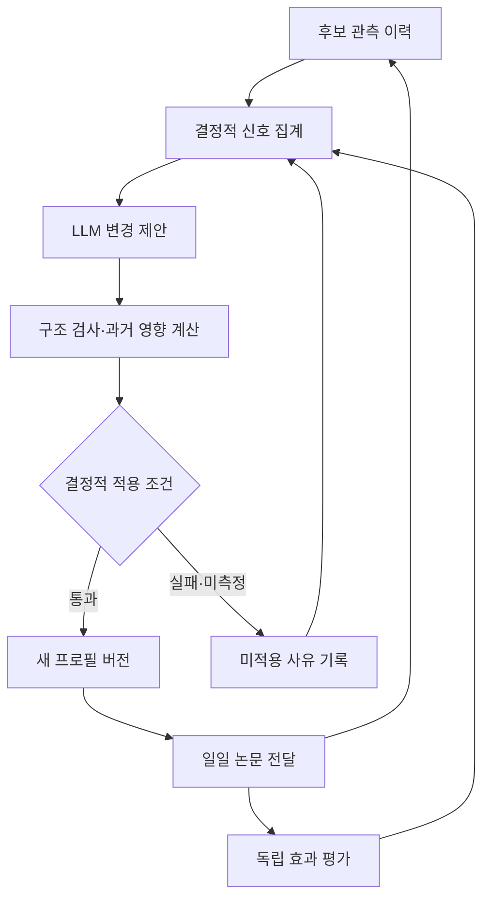

# ASTRA 연구 트렌드 모니터링 고도화 최종 계획서

작성일: 2026-09-10 (사용자 제공, 2026-09-11 저장소 반입)
개정 범위: 첨부 원안의 17개 절과 A~E 계획을 유지한다. 사용자는 처음 키워드·프로필만 설정하고 이후 결과 메일만 받는다. 제안·판정·키워드 추가·효과 관측·복구는 자동 수행하며 사람 승인·검토·라벨링을 운영 조건으로 두지 않는다.
문서 상태: 구현 착수용 설계안. 실제 저장소·DB·실행 로그에 대한 검증과 구현은 아직 수행하지 않음.

이 문서는 `docs/AGENT_METHOD_PLAN_2026-09-10.md`(근거 결손 반응 행동 선택 에이전트 안)를 **대체한다**.

**결론: 기존의 LLM 논문 요약과 동향 서술을 핵심 산출물로 유지하고, 일일 선별은 명시적인 결정적 정책으로 정리한다. 추가 에이전트는 논문 읽기 순서를 선택하는 대신, 관측 이력에서 검색 프로필 변경 후보를 제안한다. 변경은 로컬 영향 분석과 사전에 고정한 결정적 적용 조건을 통과한 경우 자동 적용하고, 이후 독립적인 평가로 효과를 확인한다.**

사용자 원문 요구(2026-09-11): "지금 최신 동향과 관련성을 최우선으로 반영하는게 아닌 것 같아."

## 1. 계획의 근거와 확정 범위

### 1.1 확인한 자료

이 계획은 사용자가 제공한 대화와 첨부 시스템 설명을 근거로 작성했다. 첨부 문서는 `run_profile_scan.py`, `profile_scoring.py`, `research_profile.py`, `summarize_engine.py`, `verify.py`, `trend_report.py`, `review_app.py` 등의 역할과 검색·후보·요약 저장 구조를 설명한다.
자동 운영은 검색, 결정적 선별, 원문 확보, LLM 요약, 수치 대조, 축적, 동향 작성, 메일 전달로 구성된다. 코드 실행 확인은 비동기로 분기한다. 이번 계획의 사용자 필수 조작은 초기 프로필 설정뿐이다.

### 1.2 실측값으로 사용하지 않는 항목

| 제공된 주장 | 이번 계획에서의 취급 | 구현 착수 시 확인할 자료 |
|---|---|---|
| 적중률 55%에서 80.7%로 변화 | 사용자 제공 이력이며 개선 성과로 확정하지 않음 | 동일 모집단 여부, 산식, 기간, 원시 후보, 실행 로그 |
| 후보 539편 또는 612편 보존 | 시점이 다른 후보 규모로 취급 | 중복 제거 후 고유 논문 수, 관측 행 수, 메타데이터 보존 범위 |
| Gemini 운행당 8회 | 과거 사례로 취급 | 요청별 목적·시도·토큰·시간 기록 |
| Groq 편당 25분, 원문 40~85% | 일반 성능으로 인용하지 않음 | 논문 길이, 입력 절단, 청크 수, 지연 및 coverage 정의 |
| 기존 실패 이력에 읽기 순서 문제 없음 | 문제 부재의 증명으로 삼지 않음 | 실제 이슈·운영 기록과 선택 손실 사례 |
| 특정 구조의 특허 우위 | 판단 보류 | 별도의 선행기술 조사와 차별성 검토 |

이하 일정·호출량·검토량 등 제안 수치는 모두 **(목표)** 또는 설계 예시이다.

### 1.3 이번 작업의 범위

운영 선별 정책, 프로필 개선 루프, 효과 평가, 예산 보호, 자동 적용·복구를 설계한다. 사업계획서는 키워드 추출이나 과제 범위 변경의 근거로 쓰지 않는다. 연구축·키워드의 권위 있는 기준은 구현 시점의 활성 프로필과 사용자의 명시적 결정이다.

## 2. 시스템 목적과 성공의 정의

### 2.1 목적

1. **발견:** 기존 키워드에 걸리는 논문뿐 아니라 관측 범위에서 새롭게 나타난 관련 연구를 포착한다.
2. **선별:** 사용자가 정한 관련성 계층을 지키고 같은 계층에서는 최신 논문을 우선한다.
3. **이해:** LLM이 문제의식·방법·결과·한계를 구조화하고 논문 간 관계를 설명한다.
4. **신뢰:** 관측 범위, 검증 수준, 누락, 실패, 비용을 실제 상태에 맞게 표시한다.

### 2.2 LLM의 역할

사용자는 초기 키워드를 설정한다. 이후 수집·선정·분석·요약·동향·발송과 주간 개선은 모두 자동 수행한다. 초기 사용자 키워드와 자동 추가어의 출처를 분리 기록한다. 사용자가 정한 연구축과 핵심 키워드는 자동 삭제하지 않는다.

| 작업 | LLM 역할 | 결정적 코드의 역할 |
|---|---|---|
| 개별 논문 요약 | 원문 기반 내용 이해·구조화 | 문장 ID, 입력 범위, 수치 대조, 상태 저장 |
| 동향 서술 | 논문 간 공통점·차이·연구적 시사점 설명 | 통계 산출, 논문 ID 연결, 관측 기간 표시 |
| 새 용어 탐색 | 후보 용어의 문맥·다의성 해석, 변경 제안 | 빈도·출처·원문 위치 집계 |
| 일일 논문 선별 | 참여하지 않음 | 적격성, 계층, 최신성, 안정적 ID로 정렬 |
| 프로필 변경 | 허용된 변경안 작성 | 영향 계산, 제약 검사, 조건에 따른 자동 적용·보류 |
| 수치 확인 | 검증 통과 여부를 선언하지 않음 | 원문 대조 범위 안에서 확인 가능한 상태 기록 |
| 코드 실행 결과 | 성공 판정에 참여하지 않음 | 종료 코드·실행 단계·측정 결과로 구분 |

**모델은 제한된 판단을 제안할 수 있지만, 운영 정책을 직접 바꾸거나 자신의 제안에 적용 판정을 내릴 수 없다.**

## 3. 이전 제안에서 바로잡을 사항

| 이전 주장 | 최종 계획의 정정 |
|---|---|
| 트렌드 추종에 기여한 것은 모두 LLM 없는 장치 | 발견·선별과 이해·서술은 모두 필요하며 LLM은 후자의 핵심 |
| 가중치 합산은 항상 잘못됨 | 엄격한 계층 우선 정책을 원할 때 합산이 부적합함. 가중합 자체가 일반적으로 잘못된 것은 아님 |
| 튜플만 바꾸면 계층 역전이 끝남 | 다양성 배분, reserve, 필터, UI·메일 재정렬까지 같은 계약을 지켜야 함 |
| 계층과 결합 여부로 8개 밴드 | 활성 계층 수와 조합 정의를 먼저 확인. 근거 없이 0.4 계층을 추가하지 않음 |
| 로컬 재채점으로 노이즈를 실측 | 키워드 적중과 규칙 위험은 계산 가능. 의미상 관련·무관 판정에는 독립 라벨이 필요 |
| 저장 후보만으로 놓친 논문 전체 평가 가능 | 후보 내부 선별 누락만 평가 가능. 수집 누락에는 독립 관측 집합이 필요 |
| 소급 실험은 API가 전혀 필요 없음 | 보존된 입력·제안이 있으면 재생 가능. 미보존 과거 검색 응답이나 새 LLM 제안은 로컬 계산만으로 복원 불가 |
| 주 1~2회 호출이므로 예산 문제가 사라짐 | 입력량·출력량·재시도·공유 한도를 포함해 제한해야 함 |
| 수치 문자열 일치가 내용 검증 성공 | 수치 존재와 지표·조건·비교대상의 의미 일치는 다름 |
| 운영 가치가 있으면 논문·특허 기여도 성립 | 운영 개선과 연구적 신규성은 별도 검증 대상 |

## 4. 두 개의 운영 루프

### 4.1 일일 논문 전달 루프

기존 운영 진입점이 활성 프로필의 고정 버전을 읽고 검색부터 발송까지 수행한다. 실행 중간에 프로필을 다시 읽지 않는다. 본문 확보 실패와 모델 실패는 논문의 관련성을 바꾸지 않는다.

| 순서 | 입력·처리 | 출력 |
|---|---|---|
| 1 | 활성 프로필·검색 기간 고정 | 실행 ID, 프로필 버전, 검색 설정 |
| 2 | 기존 학술 소스 검색 | 원시 후보 및 검색 응답 상태 |
| 3 | 중복 제거·적격성 검사·정렬 | 전체 순위, 선택 및 제외 이유 |
| 4 | 선택 논문의 전문·초록 확보 | 원문 종류, 추출 방식, 해시 |
| 5 | LLM 구조화 요약 | 요약, 문장 근거, 모델·입력량 |
| 6 | 수치·근거 대조 | 대조 상태, 미확인 항목 |
| 7 | 통계와 LLM 동향 작성 | 관측 통계와 해석을 구분한 동향 |
| 8 | 결과 저장·기존 전달 경로 실행 | 다이제스트, 전달 상태, 운영 로그 |

### 4.2 주간 프로필 개선 루프

관측된 후보와 실패 이유를 모아 규칙 기반 신호를 만든 뒤 LLM이 제한된 변경안을 제시한다. 로컬 영향 분석과 사전에 고정한 결정적 적용 조건을 통과한 변경만 다음 일일 실행부터 자동 반영한다. 사람 응답을 기다리는 단계는 두지 않는다.



주간 개선기는 일일 전달의 필수 의존성이 아니다. 별도 범용 에이전트 프레임워크를 도입하지 않는다.

## 5. A단계: 일일 선별 정책 명시화

### 5.1 해결할 문제

표적어 단독의 관련성 값이 0.80이고, 동향어 결합 0.60에 도메인 0.20과 최신성 0.15를 더하면 0.95가 된다. **제공된 산식이 실제 코드와 같다는 조건에서** 계층 역전 가능성을 보여준다.
요구사항은 "관련성 계층 우선, 같은 계층에서는 최신 우선"으로 명시한다. 이를 코드와 운영 전 경로에서 보장한다.

### 5.2 관련성의 정의

여기서 관련성은 의미상 참값이 아니라 **프로필 키워드가 정한 정책상 관련성**이다.

```
# 오름차순 정렬에 쓰는 개념적 계약. 실제 필드명은 코드 확인 후 확정.
sort_key = (
    -tier_priority,
    -publication_day_ordinal,
    -domain_hit_count,
    canonical_paper_key,
)
```

| 필드 | 기본 규칙 |
|---|---|
| `tier_priority` | 다의어 guard를 통과한 core 키워드 중 가장 높은 계층. 부동소수점 가중치를 직접 비교하기보다 계층의 순서 값을 사용 |
| `publication_day_ordinal` | 비교 가능한 공개일을 일 단위로 정규화. API가 제공한 시·분의 차이로 한 소스를 유리하게 만들지 않음 |
| `domain_hit_count` | 같은 날짜일 때 서로 다른 도메인 개념의 적중 수. 동의어 중복 집계 금지 |
| `canonical_paper_key` | 이미 사용 중인 안정적 논문 식별 규칙 재사용. 문자열 오름차순 |

구현 시 실제 활성 프로필에서 계층 목록을 읽는다. 확인되지 않은 계층을 새로 만들지 않는다.

### 5.3 결합축 처리

기본안에서는 결합축 여부를 설명 필드로 남기고 최신성보다 앞세우지 않는다. 그렇지 않으면 같은 가중치의 오래된 결합 논문이 최신 단독 논문을 이겨 "같은 관련성이면 최신"이라는 기대와 달라질 수 있다.
향후 사용자가 결합축을 독립적인 관련성 단계로 확정하면 `tier_priority, combination_priority, publication_day` 순서로 정책 버전을 바꿀 수 있다.
결합축은 동의어 두 개가 아니라 서로 다른 사용자가 정한 연구축의 동시 적중을 뜻한다. `LLM agent`와 `agentic AI`가 함께 나왔다는 이유만으로 두 연구축이 적중했다고 계산하지 않는다. 기존 연구축 매핑이 없으면 결합 판정을 새로 추정하지 않고 표시를 보류한다.

### 5.4 날짜 예외

최신성 기준은 논문의 최초 공개일로 둔다. 정확한 날짜가 없는 논문은 같은 계층의 날짜 확인 논문 뒤에 둔다. 연도만 확인된 경우 `date_precision=year`로 표시한다. 날짜 결측 처리는 서로 다른 관련성 계층을 넘지 않는다.

### 5.5 정렬 전 적격성

철회·중복·기존 노출·제외어·다의어 등 기존 적격성 규칙을 확인하고 이유를 저장한다. 원문 부재, 수치 대조 부족, 요약 실패는 관련성 계층 산정에 넣지 않는다. 상위 후보의 처리 실패와 대체 경위를 기록한다.

### 5.6 다양성·예비 후보와의 충돌 해소

엄격한 계층·최신성 우선과 연구축별 강제 자리 배분을 동시에 전역 보장할 수는 없다. 이번 기본안은 계층·최신성 우선을 택한다.

- 핵심 논문은 전체 적격 후보에서 동일한 정렬 키로 선택한다.
- 기존 다양성 규칙이 낮은 계층이나 오래된 논문을 승격한다면 핵심 선정 경로에서 제거하거나 동순위에만 제한한다.
- 연구축 분포는 통계로 보여 주되 미관측 축을 억지로 선정에 끼워 넣지 않는다.
- 예비 후보도 같은 정렬 키를 사용한다. 대체할 때는 원래 논문과 대체 이유를 표시한다.
- 상위 관련 논문이 초록만 확보되었다면 초록 기반 요약으로 표시할 수 있다.
- 메일·Streamlit·저장 조회가 표시용 합산 점수로 재정렬하지 않는지 확인한다.

### 5.7 A단계 완료 조건

계층 역전 사례와 같은 계층의 최신성 사례를 기본 회귀 사례로 둔다. 다양성·reserve를 거친 최종 선택, 날짜 결측, 동률 ID, core guard를 통과하지 못한 키워드의 계층 부여를 검사한다.
저장 후보를 구·신 정책으로 비교해 상위 K 진입·이탈·순위 이동과 그 이유를 기록한다. 목표 정책을 만족하는지가 완료 조건이며 순위 변동이 적어야 한다는 요구는 두지 않는다.

## 6. B단계: 관측 이력과 결정적 신호

### 6.1 먼저 보존 범위를 확인한다

| 필요한 정보 | 용도 | 없을 때의 처리 |
|---|---|---|
| 관측 당시 제목·초록 | 재채점·용어 추출 | 제목 기준 분석으로 표시 |
| 실행 시점·검색어·출처·기간 | 수집 경로와 분모 확인 | 복원 가능한 범위만 평가 |
| 프로필·정렬 정책 버전 | 당시 선택 재생 | 현재 정책 재채점과 당시 재생을 구분 |
| 당시 인용수·인용망 응답 | 시점 일관성 | 현재 조회값으로 과거를 덮지 않음 |
| 필터 및 중복 이유 | 누락 진단 | 알 수 없음으로 남김 |
| 변경 전후 메타데이터 | 시점별 비교 | 이후 관측부터 추가 보존 |

논문 개체의 최신 상태와 각 실행에서의 관측을 분리한다. `last_seen`만 갱신해 과거 초록·outcome을 잃는 구조라면 시점별 관측 저장을 최소한으로 추가한다.

### 6.2 주간 집계

| 신호 | 계산 | 해석 한계 |
|---|---|---|
| 미등록 용어 | core 밖 2~3gram의 고유 논문 편수 | 빈도만으로 연구 중요성 확정 불가 |
| 용어 변화 | 이번 기간과 직전 비교 기간의 편수·점유율 | 수집량·출처·프로필 변화에 영향받음 |
| 키워드 적중 | guard 이후 core별 적중·고유 기여 | 의미상 precision과 다름 |
| S2 씨앗 수율 | 반환·고유·core 적격·선정 수, 요청 시도 수 | 새 씨앗 수율은 기존 후보만으로 예측 불가 |
| 출처 기여 | 다른 출처에 없는 고유 후보와 관련 라벨 | 공통 중복 제거 규칙 필요 |
| 필터 분포 | 이유별 제외 수·대표 사례 | 규칙 오류와 실제 무관을 구분해야 함 |
| 인용 확장 기여 | lineage/frontier 유입 중 신규·미적격 후보 | 인용 연결 자체는 관련성 증명 아님 |

### 6.3 새로운 용어의 후보화

빈도와 증가폭 외에 대표 문맥, 기존 core와의 동시 출현, 서로 다른 출처·기간의 관측 여부를 보여 준다. 직전 기간에 없던 용어는 "이번 관측 기간 신규"로 기록한다.

### 6.4 B단계 산출물

주간 리뷰에 후보 용어, 대표 논문, 씨앗별 수율, 소스별 고유 기여, 제외 이유를 추가한다. 집계 자체에는 LLM을 사용하지 않는다.

## 7. C단계: 적용 전 영향 분석

### 7.1 자동 적용 게이트

| 게이트 | 확인 내용 | 결과 의미 |
|---|---|---|
| 구조·정책 검사 | 허용 액션, 기존 버전, 계층 유효성, 근거 ID, 변경 크기 | 유효한 제안인가 |
| 로컬 영향 계산 | 같은 후보 집합을 변경 전후로 재채점 | 저장 관측 안에서 무엇이 바뀌는가 |
| 적용 조건 검사 | 허용 액션·변경량·순위 영향·다의어 규칙·예산의 고정 조건 | 자동 적용 가능한 범위인가 |

### 7.2 로컬에서 계산 가능한 항목

재채점은 변경 전후에 같은 관측 스냅샷, 같은 중복 제거 규칙, 같은 정렬 정책, 같은 K를 사용한다. 키워드가 기존 후보에 전혀 나타나지 않으면 "현재 저장 이력으로 효과 평가 불가"이다.

### 7.3 노이즈율을 분리한다

`제외어 적중 / 새 적격 후보`는 규칙상 위험 지표이다. 의미상 무관 논문의 실제 비율이라고 부르지 않는다. 사용자에게 새 라벨을 요구하지 않는다.

### 7.4 씨앗 변경의 특수성

S2 씨앗 교체는 검색에서 돌아올 후보 집합 자체를 바꾸므로 저장 후보 재채점만으로 효과를 검증할 수 없다. 별도 예산의 shadow 검색이 필요하다. arXiv에서 core 목록이 검색 쿼리에도 쓰이면 core 추가에도 같은 한계가 적용된다.

### 7.5 게이트 상태

`valid`, `invalid`, `insufficient_evidence`, `needs_shadow_search`, `eligible_for_apply`, `applied`. 데이터가 없어 지표를 계산할 수 없으면 0으로 채우지 않는다.

## 8. D단계: 제한된 LLM 프로필 개선기

### 8.1 입력

현재 프로필의 변경 가능한 공개 키워드와 대표 논문 제목·초록·ID 로 제한한다(2026-09-11 정정 — astra 판정). **집계 신호(편수·증감·수율·탈락 사유)와 이전 제안의 채택·거부 이력은 보내지 않는다** — 내부 관측 결과라 규칙 4 의 "우리가 무엇을 하고 있나"에 해당한다. 모델은 대표 논문 텍스트에서 후보 용어를 스스로 뽑고, 코드가 전체 스냅샷에서 출현·guard·영향을 계산한다. 내부 사업계획서·수신자·인증 정보는 입력이 아니다.

### 8.2 허용 액션

| 액션 | 의미 | 추가 조건 |
|---|---|---|
| `add_core_term` | 기존 연구축의 관측어 추가 | 연구축과 대표 논문 연결 |
| `change_core_tier` | 기존 용어 계층 조정 | 상위 K 이동·기존 관련 논문 영향 검토 |
| `add_s2_seed` | 검색 입구 추가 제안 | 별도 탐색 예산과 shadow 평가 |
| `replace_s2_seed` | 기존 씨앗 대체 제안 | 교체 전후 수율 비교, 원래 씨앗 보존 |
| `propose_term_guard` | 다의어 문맥 조건 제안 | 사람이 읽을 수 있는 조건과 양·음성 예시 |
| `no_change` | 변경할 근거가 없음 | 정상 결과 |

자동 제외어 확대, 연구축 신설·삭제, API 한도 증가, 수신자 변경, 소스 추가, 임의 코드 실행은 권한 밖이다.

### 8.3 출력 계약 예시

```json
{
  "base_profile_version": "example-profile-version",
  "observation_snapshot_id": "example-snapshot",
  "decision": "propose",
  "proposals": [
    {
      "action": "add_core_term",
      "term": "example research term",
      "target_axis": "existing-axis-id",
      "proposed_tier": "existing-tier-id",
      "evidence_paper_keys": ["example-paper-a", "example-paper-b"],
      "reason": "관측 문맥과 기존 연구축의 연결 설명",
      "ambiguity_risks": ["같은 용어의 다른 분야 사용 가능성"]
    }
  ]
}
```

측정값은 모델 출력의 권위 있는 필드로 두지 않는다.

### 8.4 실행 제약

주간 제안 배치 1회, 최대 2호출(목표). proposal 최대 3건(목표). 변경 없음도 정상.

### 8.5 예산 보호

일일 요약과 동향 서술을 우선 작업으로 두고 주간 제안은 남은 한도에서만 실행한다. 예산 여유를 확인할 수 없으면 신호 보고서만 만들고 LLM 제안은 보류한다.

## 9. 자동 적용과 프로필 버전 관리

### 9.1 Streamlit 조회 화면

제안·변경 diff·영향·자동 판정 결과를 조회. 채택·거부 버튼이나 사람 응답 대기는 두지 않는다.

### 9.2 상태 전이

생성 → 자동 분석 → 조건 판정 → 적용·보류·탈락 → 관찰 → 유지·복구. 기준 프로필 버전이 바뀌면 `stale`. 자동 적용 시 하나의 트랜잭션에서 새 버전과 변경 이력을 저장.

### 9.3 여러 제안의 결합

제안별 단독 효과만 통과했다고 묶어서 적용하지 않는다. 묶음 전체를 다시 재채점한다.

### 9.4 탈락과 보류

판정 이유와 적용 범위를 저장. 필수 지표나 적용 규칙이 없으면 현재 프로필을 유지한다 — 사람 승인을 기다리는 상태가 아니라 미적용 결과다.

### 9.5 복구

구조 오류·기준 버전 불일치는 적용 전에 차단. 적용 이후 장애는 고정된 복구 규칙에 따라 직전 유효 프로필로. 한 주의 원시 적중률 하락만으로 자동 복구하지 않는다.

## 10. LLM 요약·동향 서술의 품질 계약

### 10.1 개별 논문 요약

기본정보 → 연구 개요 → 방법 상세 → 결과 → 주요 그림·표 → 한계 → 연구적 해석 → 연관 연구 → 결론. 초록만 입력된 경우 "초록에서 확인 불가"로 둔다.

### 10.2 검증 표시

`numbers_matched / numbers_total`은 원문 대조를 시도한 수치 중 일치한 비율이다. 논문 성능 재현이나 요약 전체의 참을 뜻하지 않는다. 원문 해시와 문장 분할 버전을 기록한다.

### 10.3 동향 서술

관측 기간·프로필 버전·출처별 수집 상태, 후보 전체의 결정적 집계와 선정 논문 집합, 논문별 검증된 발췌를 함께 넣는다. 선정 논문만 보고 분야 전체가 급증했다고 서술하지 않는다.

### 10.4 코드 실행 확인

`exit code=0`는 실행 단계의 정상 종료. 설치 성공, 스모크 성공, 성능 수치 재현을 구분한다. 코드 실행 수준은 정렬 키에 넣지 않는다.

## 11. E단계: 효과 평가와 백테스트

### 11.1 핵심 구분

| 질문 | 필요한 평가 집합 | 저장 후보만으로 가능한가 |
|---|---|---|
| 이미 수집한 논문을 더 적절히 선별했는가 | 고정 후보와 독립 관련성 라벨 | 당시 메타데이터가 있으면 가능 |
| 새 키워드가 기존 후보 중 무엇을 되살렸는가 | 고정 후보와 변경 전후 프로필 | 가능 |
| 새 씨앗이 검색 밖 논문을 더 발견하는가 | 씨앗별 검색 응답 또는 shadow 검색 | 기존 응답이 없으면 불가 |
| 전체 관련 논문을 얼마나 놓쳤는가 | 독립 관련 논문 기준 집합 | 불가 |
| 새 연구를 얼마나 빨리 포착했는가 | 공개·관측·선별·전달 시점 | 시점 이력이 있는 범위에서 가능 |

### 11.2 핵심 지표 정의

core 적중 비율(precision 아님) · Precision@K · 후보 내 선별 recall · 독립 집합 포착률 · 의미상 노이즈율 · 수집 지연 · 전달 지연 · 용어 반영 지연 · 제안 효율 · 운영 비용 · 요약 품질. 미포착 논문은 지연 계산에서 삭제하지 않는다.

### 11.3 독립 기준 집합

활성 키워드에 걸린 후보만으로 만들지 않는다. 학회·저널 목차, 독립적인 넓은 쿼리 등을 활용한다. 결과를 보기 전에 고정한다.

### 11.4 자동 평가 범위와 라벨 처리

운영 중 사용자 라벨링은 없다. 직접 관련 / 간접 관련 / 무관 / 미판정. 라벨이 없으면 의미상 정확도는 미측정.

### 11.5 F/R/A 비교

| 실험군 | 갱신 방식 | 공정한 비교 조건 |
|---|---|---|
| F: 고정 | 초기 프로필 유지 | 같은 시작 시점·정렬·검색 예산 |
| R: 규칙 | 사전 고정된 빈도·문맥·예산 규칙으로 제안 | A와 같은 신호·변경 액션·최대 변경량 |
| A: LLM | 같은 신호에서 모델이 제한된 변경 제안 | R과 같은 자동 적용 게이트·변경량 |

### 11.6 실험 순서와 시점 누수 방지

1. 정렬 정책 A단계를 먼저 고정한다.
2. 과거 자료의 보존 수준을 조사하고 재생 가능한 구간을 확정한다.
3. 개발 구간에서 임계값을 정하고 평가 구간에서는 바꾸지 않는다.
4. 각 주의 제안 입력은 그 주까지 관측된 정보만 사용한다.
5. 변경안의 효과는 이후 기간에서 평가한다.
6. 당시 보존하지 않은 최신 값을 과거 입력처럼 사용하지 않는다.
7. LLM의 모델 식별자·프롬프트·입출력·설정을 보존한다.

### 11.7 효과 판단

초기 2주 기준선 + 최소 4주 shadow(목표). 허용 악화 폭과 주요 비교 지표는 평가 시작 전에 고정한다.

## 12. 데이터·모듈 변경 계획

### 12.1 저장 구조

프로필 버전 · 후보 관측 · 관측 snapshot · 변경 제안 · 영향 분석 · 자동 판정 · 평가 라벨 · 실험 실행. 기존 테이블을 파괴적으로 재구성하지 않는다. 추가형 변경으로 시작한다.

### 12.2 파일별 예상 변경

| 파일·영역 | 변경 의도 | 착수 시 확인 |
|---|---|---|
| `profile_scoring.py` | 정렬 키와 설명 필드 분리 | 현재 합산·guard·결합 정의 |
| `selection.py` | 다양성·reserve가 정책을 지키도록 연계 | 다른 호출 경로 영향 |
| `run_profile_scan.py` | 실행 단위 프로필 버전 고정·후보 관측 기록 | 일일 진입점과 부분 실패 처리 |
| `research_profile.py` | 프로필 버전·제안·자동 판정 저장 | 스키마 소유권과 트랜잭션 |
| `trend_report.py` | 결정적 신호 재사용·관측 범위 표시 | emerging·lineage·frontier 구현 범위 |
| `api_usage.py` | 요약·동향·제안·탐색 목적 구분 | 현재 계측 필드 |
| `review_core.py` | 분석 결과 조회·stale 표시 | UI 비의존 로직 유지 |
| `review_app.py` | 제안·영향·자동 판정 조회 화면 | 기존 화면과 권한 경계 |
| `summarize_engine.py`·프롬프트 | 기존 품질 계약 보존 | 범위·입력·grounding 보존 |
| `digest.py` | 정렬 유지·관측/검증/실패 상태 표시 | plain·HTML 양쪽 렌더링 |
| 신규 최소 모듈 | 필요 시 `profile_advisor.py` | 기존 모듈로 충분하면 신설하지 않음 |
| 평가 스크립트 | snapshot 기반 재생과 비교 보고 | 운영 경로에서 분리 |

## 13. 장애·예외 처리

제안 모델 429·503·timeout → 상한 내 재시도 후 중단, 기존 프로필 유지. 응답 형식 오류 → 구조 검사 실패. 존재하지 않는 근거 ID → 제안 무효. 새 씨앗 검색 기록 없음 → shadow 필요 또는 보류. 적용 전 프로필 변경 → stale 재분석. DB 잠금 → 트랜잭션 취소, 반쪽 적용 금지. 검색 소스 부분 실패 → 성공 소스 결과와 실패 상태 보존. 요약 실패 → 제목·링크·원인 표시. 동향 실패 → 결정적 통계와 성공 요약 사용. 메일 전송 실패 → 기존 재시도·중복 방지. 적용 후 품질 악화 → 고정된 복구 조건 충족 시 이전 유효 버전 복구.

주간 개선기가 cursor를 직접 변경하지 않는다.

## 14. 단계별 구현·검증 일정

| 단계 | 작업 | 예상 기간 | 완료 판정 |
|---|---|---|---|
| 0 | 실제 코드·DB·AGENTS 규칙·호출 경로 확인, 기준선 고정 | 1~2일(목표) | 현재 정책·보존 결손·재생 범위 문서화 |
| A | 튜플 정렬 및 최종 선별 경로 정리 | 1~2일(목표) | 계층·최신성·reserve·렌더링 계약 확인 |
| B | 관측 보존·신호 집계·주간 화면 | 2~3일(목표) | 고유 편수·분모·근거를 추적 가능 |
| C | 단독·묶음 영향 분석 | 2~3일(목표) | 같은 snapshot에서 결과 재현, 미측정 구분 |
| D | 제한된 LLM 제안·자동 게이트·버전 적용·복구 | 3~5일(목표) | 게이트 우회 차단, 장애 격리, 예산 상한 확인 |
| E1 | 기존 평가 자료·독립 관측·자동 백테스트 도구 | 3~5일(목표) | 평가 가능 범위와 누수 점검 완료 |
| E2 | 기준선·전향적 shadow 비교 | 기준선 2주+평가 최소 4주(목표) | 원시 분모·품질·비용을 함께 보고 |

### 14.1 운영 전환 조건

1. A는 테스트와 저장 후보 비교를 통과한 뒤 기존 선별 정책과 결과 차이를 검토한다.
2. B·C는 읽기·분석 기능으로 먼저 사용한다.
3. D는 제안·shadow 분석부터 시작한다. 활성 프로필 반영은 적용 규칙이 설정되고 필수 측정 조건을 통과한 경우 자동 수행한다.
4. 새 씨앗·새 쿼리는 shadow 관측 결과가 있어야 운영 효과를 주장한다.
5. E 결과가 A의 우위를 지지하지 않으면 LLM 제안기를 상시 운영할 의무는 없다.

### 14.2 필요한 검증

계층 역전과 최신성 외에 게이트 통과 없는 적용, 수정 제안에 대한 이전 게이트 재사용, 동시 프로필 변경, 부분 DB 저장, 실패한 제안기가 일일 루프를 중단하는 경우, 평가 시점 이후 정보 사용을 확인한다.

## 15. 역할·산출물·수용 기준

| 수용 기준 | 목표 또는 판정 방식 |
|---|---|
| 엄격한 선별 정책 | 적격 후보의 계층·최신성 계약 위반 0건(목표) |
| 자동 적용 경계 | 게이트 미통과 프로필 적용 0건(목표) |
| 예산 경계 | 주간 제안 attempt 상한 초과 0건(목표) |
| 장애 격리 | 제안기 장애를 주입해 일일 전달 경로 비중단 확인 |
| 재현성 | 동일 snapshot·프로필·정책의 결정적 결과 동일 |
| 표시 정직성 | 미판정·미측정·초록 기반·발송 실패 상태가 결과에 노출됨 |
| 연구 효과 | 독립 라벨과 이후 기간 평가로 확인. 수치 기준은 기준선 후 사전 고정 |

## 16. 연구 기여의 검증 범위

연구 질문: **"고정된 연구축과 제한된 예산 아래, 관측 신호를 받은 LLM의 프로필 변경 제안이 규칙 기반 제안보다 새로운 관련 연구의 포착을 개선하는가"**. 효과가 나타나지 않아도 실패 조건을 분해할 수 있어야 한다.

## 17. 최종 실행 방침

첫 착수는 **실제 정렬 호출 경로와 후보 보존 수준 확인**이다. 이후 A·B·C를 구현해 운영상 설명 가능성과 측정 기반을 확보하고, D를 제안 전용으로 붙인다. E에서 자동 비교·전향적 관측으로 추가 가치를 평가한다.
**이번 고도화의 완성 기준은 에이전트 호출이 늘어나는 것이 아니라, 관련 연구를 더 적시에 발견하고 그 내용을 더 신뢰할 수 있게 전달했다는 증거를 남기는 것이다.**

## 부록. 구현 착수 체크리스트

- [ ] 최초 키워드·프로필 설정 이후 사용자 승인·검토·라벨링·수동 복구를 요구하는 의존성이 없는지 확인한다.
- [ ] 실제 저장소의 AGENTS.md·현재 브랜치·작업 변경 상태를 확인한다.
- [ ] 활성 프로필에서 core·가중치·도메인·씨앗·제외어를 읽어 기준 버전으로 고정한다.
- [ ] 관련성 계층과 최신성, 결합축, 다양성의 실제 우선순위를 확인한다.
- [ ] `score_and_rank`의 호출자와 최종 digest·reserve의 재정렬 경로를 확인한다.
- [ ] 후보 전체에 초록·공개일·관측 시점·이유·출처가 보존되는지 조사한다.
- [ ] 현재 실적의 산식·분모·기간을 확인하고 core 적중과 precision을 분리한다.
- [ ] 동일 snapshot의 구·신 정책 순위 차이를 저장한다.
- [ ] 제안 단독과 적용 묶음 전체의 영향 분석을 구분한다.
- [ ] 씨앗·쿼리 변경의 수집 효과를 로컬 재채점 결과와 분리한다.
- [ ] 적용 대상 revision·기준 버전·분석 snapshot·판정 규칙 버전을 묶어 저장한다.
- [ ] 제안기 장애와 예산 소진을 주입해 기존 일일 경로를 확인한다.
- [ ] 운영 데이터와 실험 입력·라벨·프로필 버전을 분리해 보존한다.
- [ ] 결과 보고에 미측정·미포착·불확실 항목과 원시 분모를 포함한다.
