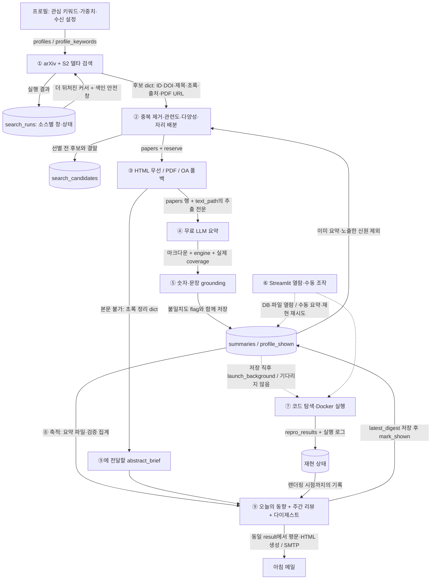

# paper-harness 시스템 개요 — 검색에서 아침 메일까지

작성일: 2026-09-08. 대상: 로컬 `moon201595/agent`, `main`. 이 문서는 발표 순서에 맞춰 현재 구현, 실제 실패와 수정, 남은 과제를 연결한다. 수치는 사전 실측 자료를 인용하며 재측정하지 않는다. 코드·주석이 충돌하면 실행 로직과 날짜가 최신인 정정을 우선한다.

실측 자료 약칭 **M**: `/tmp/claude-1000/-home-mjh-paper-harness/290324c8-4cfb-4b09-b89c-bdba4f9764a8/scratchpad/measured_facts.md`. M의 마지막 **15:20 갱신**이 앞선 값보다 우선한다. 따라서 작성 기준은 187커밋·HEAD `2b52da7`, 사전 테스트 764개 통과다. 요청문에 남은 186커밋·761개는 갱신 전 값이다. 문서 끝에서 요청된 pytest 명령의 실제 결과를 별도로 기록한다. (M: 저장소 규모, 갱신)

## 1. 한 장 요약 — 논문 목록을 읽을 거리와 동향으로 바꾼다

이 시스템의 목적은 관심 분야의 새 논문을 찾아, 읽을 수 있는 본문을 확보하고, 근거가 붙은 요약과 분야 동향을 하루 한 통의 메일로 전달하는 것이다. 사람이 매번 검색어를 입력하고 여러 사이트와 PDF를 오가는 부담을 줄이되, 기계가 확인하지 않은 성공이나 품질을 만들어내지 않는 것이 설계 기준이다. (AGENTS.md: 프로젝트 개요; CLAUDE.md: 규칙 7~9)

핵심은 **논문 발견 → 읽을 자료의 확보 → 무료 LLM 서술 → 결정적 검증 → 저장된 상태로 배달**이라는 연결이다. Python 도구가 검색·선별·검증·저장을 수행하고, Gemini 우선/Groq 대체의 무료 API가 ④ 요약과 ⑨ 동향 서술을 담당한다. SQLite와 추출 텍스트·마크다운 파일이 단계 사이의 기억이다. MCP는 도구를 노출하는 인터페이스이며, 매일 운행할 때 대화형 클라이언트를 반드시 띄울 필요는 없다. (README.md: 구성·사용 흐름; CLAUDE.md: 규칙 1~7)

발표에서 구별할 세 가지가 있다.

- **①~⑨는 역사적 단계 이름이지 실행 순서가 아니다.** 자동 주 흐름은 ①→②→③→④→⑤→⑧→⑨다.
- **⑥은 옆에 붙은 열람·수동 조작 UI다.** 2026-08-24 승인 게이트 제거 뒤 `review_status`는 배달 자격을 가르지 않는다. 사전 집계의 pending 126편·approved 6편을 승인 대기열로 설명하면 틀린다.
- **⑦은 저장 뒤 백그라운드로 갈라진다.** 배달은 재현 완료를 기다리지 않으며, 메일에는 그 시점의 실행 중·실패·성공 기록이 들어간다.

근거: M: 갱신·④ 요약 상태 및 작업 지시의 사전 확인; `batch_summarize.py` 모듈 설명; `docker_runner.launch_background()`; 상세 호출 관계는 다음 절에서 확인한다.

## 2. 전체 흐름 한 장 — 저장이 중심이고 재현은 옆으로 흐른다



그림의 ⑧은 마지막 보관함 하나가 아니다. 검색 이력은 ①에서, 후보는 ②에서, 추출문은 ③에서 이미 저장된다. ⑤를 거친 요약 저장이 ⑦과 ⑨가 공유하는 주요 전이 지점이다. 초록 정리는 `abstract_only`와 `brief`로 반환돼 메일 입력에 실리지만 `summaries`에는 저장되지 않고 ⑤ 본문 검증·⑦ 재현도 타지 않는다. (research_profile.py:418,507; batch_summarize.py:52,169; run_profile_scan.py:611)

| 운행 진입점 | 실제 호출 연결 | 상태가 넘어가는 곳과 실패 범위 |
| --- | --- | --- |
| 매일 cron | `run_daily_scan.sh` → `run_profile_scan.py --all --send` → `scan_all_profiles` → `scan_and_digest` | 프로필별 예외를 격리한다. 스캔·발송 실패는 최종 종료코드에 반영한다. |
| 한 프로필 처리 | `scan_profile` → 상위·예비 후보에 `_process_paper` 직렬 호출 | 한 논문의 예외는 다음 후보를 막지 않는다. 예산 초과는 `deferred`로 다음 운행에 남긴다. |
| 본문 처리 | `fetch_paper` 또는 `fetch_pdf_from_url` → `read_full_text` → `summarize` → `save_summary` | 저장 직전 검증한다. 불일치는 저장 차단이 아니다. 이후 철회 확인과 재현 실행 요청이 이어진다. |
| 배달 준비 | `trend_report.narrative/build` → `generate_digest` → `save_digest` → `mark_shown` | 동향·철회 조회 실패는 부가 정보만 빠진다. 현재 노출 처리는 SMTP 성공보다 앞선다. |
| 배달 | `_deliver` → `generate_digest_html` → `send_digest_email` | 같은 `result`를 두 렌더러에 전달한다. 실패해도 다른 프로필은 계속되지만 최종 실패 신호는 남는다. |
| 수동 사용 | MCP 도구 직접 호출, `batch_summarize.py`, `review_app.py` → `review_core` | 자동 운행과 같은 도구를 재사용한다. UI 승인 상태는 자동 배달 게이트가 아니다. |

근거: run_profile_scan.py:247,511,595,714,721,751,780,812; batch_summarize.py:82,182; CLAUDE.md: 규칙 5.

**실패가 번지는 경계**는 소스→논문→프로필 순으로 나뉜다. arXiv만 실패하면 S2로, S2만 실패하면 arXiv로 계속한다. 두 검색 소스가 모두 실패하면 해당 프로필은 실패한다. 이를 새 논문 0편으로 포장하지 않는다. ④ 실패는 해당 논문에 남기고 예비 후보를 시도한다. ⑦ 실패는 별도 프로세스와 DB 결과에 남으므로 당일 메일을 막지 않는다. (run_profile_scan.py:283,354,597; batch_summarize.py:179)

## 3. 단계별 상세 — 무엇을 받아 무엇을 넘기는가

### ① 검색: 새 논문과 다시 볼 구간을 함께 찾는다

입력은 프로필의 핵심 키워드와 `search_runs`의 소스별 검색 창이다. `scan_profile`은 `find_new_papers.find_new_papers_since`와 `s2_delta.find_new_papers_since`를 호출하고 결과를 합친다. arXiv는 `submittedDate` 내림차순과 날짜 범위 쿼리를 사용하며, `delta_search.collect_since`가 클라이언트에서도 날짜 경계·짧은 페이지·빈 페이지를 확인한다. OR 검색어 전체를 괄호로 묶어 날짜 제한이 일부 검색어에만 걸리지 않게 한다. S2는 키워드별 날짜 창 검색과 페이지네이션으로 저널 논문까지 넓힌다. (find_new_papers.py:39,64; delta_search.py:89; s2_delta.py:150,225)

출력은 `papers` 목록과 `status/query/since/until` 등 실행 메타데이터다. 후보에는 arXiv ID가 없을 수 있으며 DOI·제목·초록·OA PDF URL·출처가 후속 단계의 대체 경로가 된다. S2의 `None`은 실패이고 빈 검색 결과는 정상 0건이다. 페이지·시간 상한이나 일부 키워드 실패는 `partial`, 전 키워드 실패는 `failed`다. 이 상태를 `search_runs`에 소스별로 남긴다. LLM은 검색 완료 여부를 판단하지 않는다. (s2_delta.py:107,132,291; run_profile_scan.py:296,331)

보조 탐색도 있다. MCP의 S2 references/citations는 한 단계 인용망 탐색이며, 로컬 검색은 BM25와 임베딩 유사도를 RRF로 합친다. 임베딩은 `paper_embeddings`에 캐시하고 키가 없으면 BM25로 저하한다. 이 도구들을 매일 델타 검색이 전부 실행하는 것으로 그리면 안 된다. (README.md: 도구 12종; server.py:565,581,596,633)

### ② 선별: 관련도와 읽을 자리를 구분한다

`selection.dedupe`는 arXiv ID 또는 정규화 제목으로 중복을 합치고 비어 있는 메타데이터를 보완한다. MCP·키워드 배치의 `dedupe_and_rank`는 인용수→연도 정렬이지만, **일일 프로필 스캔은 `dedupe` 뒤 `profile_scoring.score_and_rank`를 사용한다.** 두 랭킹을 같은 방법으로 설명하면 틀린다. (selection.py:47,82; batch_summarize.py:228; run_profile_scan.py:361,399)

프로필 점수는 제외어, 핵심어 적중·가중치, 도메인 적중, venue, 최신성을 결정적으로 계산한다. 다의어 가드와 긴 키워드에 흡수되는 짧은 키워드 제거로 무관한 적중과 이중 가점을 줄인다. 현재 관련도 계산은 최고 적중 가중치와 적중 폭을 사용하며, 인용수는 이 총점에 들어가지 않는다. `_score`에 적중어·최고 가중치·대표어·점수 내역을 남겨 왜 선택됐는지 설명한다. (profile_scoring.py:169,222,236,272)

순서는 이미 요약·노출한 신원 제외 → 채점 → 내용 자리 자격 → 대표 키워드 다양성 → 상위·예비 목록 분리다. 대표 키워드는 가장 높은 가중치의 적중어다. 링크가 있다고 본문을 얻었다고 확정하지 않고, ③ 실제 처리 실패 뒤 예비 후보로 자리를 채운다. 초록 정리가 있으면 내용 자리를 유지한다. `search_candidates`에는 선별 이전 후보와 `content/title_only/reserve/dropped/filtered` 결말을 남긴다. `title_only`는 내부 상태 이름이며 현재 모든 후보를 각주 목록으로 화면에 그대로 보여준다는 뜻은 아니다. (run_profile_scan.py:139,163,199,372,544,611; research_profile.py:410,418; digest.py:902)

이 단계에는 외부 API나 LLM이 없다. 다만 입력 후보 자체가 검색 창·API 가용성·프로필 키워드의 영향을 받는다. 결정적이라는 말은 편향이나 누락이 없다는 뜻이 아니다.

### ③ 본문 확보·파싱: 링크를 자료로 바꾸는 관문이다

arXiv 경로는 `server.fetch_paper`가 기존 `text_path`를 확인한 뒤 메타데이터→HTML→필요 시 PDF 순으로 수집한다. BeautifulSoup HTML 추출과 pypdf PDF 추출을 사용한다. HTML 우선은 표·2단 조판 손상이 ⑤ 거짓 불일치로 번지기 때문이다. 실제로 HTML을 받아보고 판단하며 출판 연도로 가용성을 추정하지 않는다. HTTP 상태 오류 또는 빈 HTML은 PDF 폴백 대상이지만, 모든 종류의 HTML 예외가 반드시 PDF로 복구되는 것은 아니다. 바깥 예외 처리에서는 오류 JSON을 반환한다. (server.py:219,231,728,778,809)

비-arXiv 경로는 검색 후보의 OA URL을 `fetch_pdf_from_url`로 받고 실패 시 DOI로 Unpaywall 대체 위치를 찾는다. 수동 PDF는 `ingest_local_pdf`로 들어온다. URL 확장자 대신 `%PDF-` 시그니처를 확인해 로그인 HTML을 PDF로 오인하지 않는다. 저장 후 `pdf-<내용 해시 10자리>` 합성 ID가 생기며 출처는 `papers.source`로 구분한다. 출력은 `papers` 행과 PDF·텍스트 파일, `extract_method/text_chars/text_path`다. (server.py:977,1102,1134; PROGRESS §5 평가셋 구축; batch_summarize.py:95)

본문을 못 받으면 `_abstract_only_outcome`으로 모인다. 초록이 없으면 OpenAlex의 역색인 초록을 복원하고 무료 LLM으로 초록 정리를 시도한다. 성공은 `abstract_only`, 초록까지 없으면 `fetch_failed`다. 이 얕은 경로를 본문 수치 검증 완료로 표시하지 않는다. 수집 실패는 해당 논문에 국한되고 일일 스캔이 다음 후보를 처리한다. (server.py:1056,1066; batch_summarize.py:52; run_profile_scan.py:597,611)

### ④ 요약: 무료 LLM은 서술하고 코드가 범위를 남긴다

`_process_paper`는 MCP 열람용 분할 텍스트가 아닌 `read_full_text`로 전문을 읽는다. 제목의 결정적 규칙으로 실증 연구/서베이 템플릿을 고른 뒤 `summarize_engine.summarize`를 부른다. 사람이 대화창에서 직접 요약하는 구조가 아니다. (batch_summarize.py:154; summarize_engine.py:53,67,813)

`sentence_grounding.build_tagged_chunks`가 문장 경계를 지켜 전문 전체에 고유한 `[S번호]`를 붙인다. 첫 청크는 전체 템플릿을 채우고 후속 청크는 추가 결과·한계를 보충한다. 현재 설정은 Gemini 300,000자×최대 4청크, Groq 3,000자×최대 32청크다. 이는 코드의 처리 상한이며 서비스의 보장된 무료 한도가 아니다. README의 Groq 15,000자 설명은 현재 코드와 다르다. (sentence_grounding.py:125,144; summarize_engine.py:83,105,113,694)

첫 생성 경로가 실패하면 Gemini→Groq로 넘어간다. 후속 청크 실패는 무한히 기다리지 않고 그 지점까지의 요약을 반환한다. 반환값은 `(마크다운, 엔진, 실제 coverage)`이며 성공한 청크의 문장 수로 범위를 센다. 설정상 읽을 수 있는 범위인 `planned_coverage_ratio`와 구분한다. coverage는 텍스트가 처리 경로에 포함된 비율이며, LLM이 내용을 제대로 이해했다는 정확도 측정은 아니다. (summarize_engine.py:694,767,779,813)

### ⑤ 검증: 요약에 있는 숫자의 출처를 확인한다

`save_summary`가 저장 직전에 `verify_numbers(..., expect_grounded=True)`를 호출한다. 숫자 토큰을 정규화하고 `[S번호]`가 있으면 같은 분할 함수로 찾은 원문 문장 ±1에서 대조한다. 구형 태그 없는 수치는 원문 전체 대조로 폴백하며, 새 요약의 태그 누락은 별도 `untagged` 신호로 남긴다. (server.py:1216; verify.py:249,260; sentence_grounding.py:155)

출력은 개별 `found/grounded/sentence_id/cited_text`와 총 숫자·일치 수·불일치 목록이다. DB에는 집계와 요약 경로를 저장하고, 구조화 JSON은 `summary_parser`가 마크다운 절과 재검증 결과를 묶어 제공한다. **grounded는 문장 제한 검사를 했다는 뜻이며 found가 참이라는 뜻과 다르다.** 불일치는 flag-and-pass로 저장·배달을 막지 않는다. 요약을 통과할 때까지 다시 쓰게 하면 숫자를 지워 통과하는 방향으로 최적화될 수 있어 검증 재작성 루프를 두지 않는다. (verify.py:283; summary_parser.py:51; server.py:1238,1257; PROGRESS §4)

이 검사는 주장 전체의 진실성·조건 일치·논문 결과 재현성을 증명하지 않는다. 단위 환산·퍼센트와 퍼센트포인트·추출 손상 등의 한계도 남는다. 검증 API 장애는 없지만 원문 파일·DB 접근 오류는 저장 호출 실패로 번질 수 있다. (README.md: 수치 검증기의 한계; server.py:1205)

### ⑥ 사람 판단: 자동 흐름 밖에서 근거를 열어본다

`review_app`은 검색·PDF 업로드·요약 열람·원문 이미지·검증 불일치·재현 상태·프로필 운행을 보여준다. 무거운 검색·배치는 별도 프로세스로 실행하고 세션별 진행 파일·PID로 진행과 취소를 다룬다. `review_core`는 Streamlit 화면에서 독립시킨 조회·요약·상태 계산을 맡는다. (review_app.py:471,527,580,608,1088,1339; review_core.py:110,154,162,213)

입력은 저장된 DB·파일과 사람의 명시적 버튼 조작이고, 출력은 새 요약·수동 재현 요청·프로필 변경이다. UI에서 요약을 새로 만들 때도 같은 무료 엔진과 `save_summary`를 사용한다. 원문 번역은 LLM 보조 기능이지만 승인이나 진실성 판정이 아니다. **2026-08-24 제거된 승인 게이트를 다시 그림 안에 넣지 않는다.** 남은 `review_status` 컬럼과 `set_review_status` 함수는 자동 배달 필터의 증거가 아니다. (review_core.py:213,257; review_app.py:461; server.py:1295; 커밋 `b02bc69`)

### ⑦ 코드 재현: 격리된 설치·실행 스모크 테스트다

`code_finder.find_repo_candidates`가 저장된 전문의 코드 링크를 찾고 GitHub 검색 및 HuggingFace 모델카드의 실제 저장소 링크를 보완한다. 흔한 도구 저장소·비코드 링크를 배제하고 검색어 외 제목 토큰·저자/소유자 등의 독립적 근거를 요구한다. 출력은 출처·신뢰도가 붙은 저장소 후보이며, 신뢰도는 LLM 평점이 아닌 규칙 기반 신호다. (code_finder.py:191,223,264,364,388)

`reproduce`는 후보를 최대 3개 시도한다. clone→설치 계획 추정→Docker 빌드→실행 순이다. pyproject/setup.py/requirements를 읽어 설치하고, 실행은 CLI `--help` 또는 실제 패키지 import를 추정한다. 설치·실행 대상이 없으면 `no_target`, 설치만 확인되고 실행 대상이 없으면 `install_only`로 기록하며 둘 다 성공이 아니다. (docker_runner.py:173,327,505)

실행 성공은 exit code 0이고 타임아웃이 없는 경우다. **논문에 보고된 정확도·속도·벤치마크를 재현했다는 뜻이 아니다.** 설치 예산 900초, 실행 예산 120초, 기본 실행 메모리 2g·CPU 2의 코드 상한을 둔다. 실행 컨테이너는 네트워크를 끄고 격리 플래그를 적용한다. 네트워크 오류처럼 보이는 로그는 실패 사유로 남길 뿐, 이를 근거로 자동으로 네트워크를 열지 않는다. 빌드 단계의 의존성 다운로드와 실행 단계의 격리는 구분한다. (docker_runner.py:43,277,401,509; PROGRESS §5 M7)

출력은 `repro_results`의 단계·성공·exit code·실패 사유와 로그, 성공 시 보존한 코드 경로다. 이미 성공했거나 `.running` 마커가 있으면 재실행을 생략한다. 별도 프로세스이므로 ⑨는 기다리지 않는다. 마커 기반 실행 중 표시는 프로세스 생존의 완전한 증명이 아니라는 한계가 있다. (docker_runner.py:543,569; storage.py:115; digest.py:476)

### ⑧ 축적: 다음 검색과 오늘의 설명이 같은 기록을 읽는다

| 상태 저장소 | 쓰는 곳 → 읽는 곳 | 이어지는 의미 |
| --- | --- | --- |
| `papers` + PDF·텍스트·이미지 파일 | ③ 수집 → ④·⑤·⑥·⑦ | 식별자, 출처, 추출 방법, 본문 경로가 근거 추적의 출발점이다. |
| `summaries` + 마크다운 | `save_summary` → ②·⑥·⑨·eval | 요약 경로, 숫자 집계, 엔진, coverage와 그 종류를 공유한다. |
| `repro_results` + 재현 로그·성공 코드 | ⑦ → ⑥·⑨ | 어떤 저장소를 어디까지 실행했는지 구분한다. DB 기본키는 논문·저장소 조합이므로 행 수는 모든 과거 시도 수가 아니다. |
| `profiles` 및 키워드·venue·수신 설정 | 프로필 편집 → ①·②·⑨ | 관심 범위·가중치·표시량·수신 설정을 코드 밖에 둔다. |
| `search_runs` | ① → 다음 ① | 소스별 완료/부분/실패와 창·키워드 지문을 보존한다. |
| `search_candidates` | ①② 후보 기록 → 관측·분석 | 선택되지 않은 논문도 관측 대상으로 남긴다. 같은 후보는 first_seen을 유지하고 최근 상태를 갱신한다. |
| `profile_shown` | 다이제스트 저장 후 → 다음 ② | 본문 없는 저널도 이미 보여준 논문인지 판별한다. 합성 ID만 믿지 않고 DOI·제목 신원을 이어야 한다. |
| `paper_embeddings` | 로컬 검색 임베딩 → 다음 로컬 검색 | 이미 계산한 벡터를 재사용한다. |
| 프로필의 최신 다이제스트 | `save_digest` → UI | cron이 혼자 돌아도 결과가 화면에 남는다. 모든 발송본의 불변 이력 저장과는 다르다. |

근거: storage.py:42,62,70,115,166; research_profile.py:28,56,127,152,265,293,418,526; server.py:1195,1445.

SQLite WAL은 배치·UI·재현 프로세스가 같은 DB를 사용할 때 읽기/쓰기 경합을 줄인다. 파일과 DB는 하나의 원자적 트랜잭션이 아니므로 경로와 파일의 일치도 관측 대상이다. 외부 API는 축적 자체에 필요하지 않지만 철회 상태 보강은 OpenAlex→필요 시 Crossref 조회를 붙인다. `None`은 미조회/확인 불가, 0은 OpenAlex 기준 철회 아님, 1은 철회 교차확인, 2는 의심 상태다. 부가 조회 실패로 요약 저장·배달을 막지 않는다. 현재 철회 조회는 arXiv ID에서 DataCite DOI를 만드는 경로이므로 합성 ID 저널의 철회를 모두 확인한다고 설명할 수 없다. (storage.py:60; server.py:1230,1356; retraction.py:75,132,149)

### ⑨ 동향 정리·배달: 개별 결과를 한 흐름으로 묶는다

**오늘의 동향**은 이번 운행의 내용 자리와 보조 후보의 제목·초록을 입력으로 받는다. 내용 자리 중 숫자 전부 일치·`coverage_kind=measured`·설정된 최소 coverage 조건을 만족한 요약만 결과 절을 발췌해 추가한다. 발췌 파일 하나가 깨져도 다른 논문과 초록 기반 서술은 살린다. 서술에는 실제로 붙인 요약 편수를 라벨로 밝힌다. Gemini→Groq가 글을 쓰고 `ungrounded_numbers`가 입력 묶음에 없는 숫자를 경고한다. 이는 ⑤처럼 문장별 의미를 판정하는 검증이 아니다. (run_profile_scan.py:680; trend_report.py:292,336,377,423)

**주간 리뷰**는 저장된 요약의 `created_at`으로 이번 기간과 직전 기간을 나눈다. 논문 발표일 기준 전체 분야 추이가 아니라 **하네스에 축적된 요약의 추이**다. 키워드 빈도, 새 n-gram, 저자·출처·엔진 분포를 계산하고, S2 공통 참고문헌·Jaccard 기반 계보 묶음·그 기반 논문을 인용한 최전선 후보를 보완한다. 인용망 결과는 조회 표본·예산의 한계를 함께 표시한다. 주간 서술에는 현재 일일 경로와 달리 결과 발췌를 넣지 않는다. (trend_report.py:138,458,470,556,640,685,832)

`digest`는 네트워크 없이 저장된 요약과 검증·coverage·재현·철회·인젝션 상태를 읽어 평문과 HTML을 만든다. 초록 정리는 자기 상자 안에서 출처를 밝히고, 동향에서 언급한 논문은 번호·링크로 되돌아갈 수 있게 한다. 같은 `result['weekly_review']`가 두 렌더러에 들어가야 실제 메일 화면까지 도달한다. (digest.py:244,310,349,476,535,555,902,962,1295,1445,1453)

`email_delivery.build_message`는 평문 다음 HTML을 넣는 `multipart/alternative`를 만들고, `send_digest_email`은 Gmail SMTP·STARTTLS로 발송한다. 자격증명 값은 문서에 넣지 않는다. 동향 생성 실패는 동향 부분만 빠지고, SMTP 실패는 해당 프로필 발송 결과와 최종 종료코드에 남는다. 현재 주간 요일 검사는 UTC 기준이어서 의도한 월요일 05:00 KST 대신 화요일 05:00 KST에 붙는 문제가 남아 있다. (email_delivery.py:36,40,66; run_profile_scan.py:109,700,775,812; PROGRESS §8-71)

## 4. API 지도 — 무료라는 제약이 호출 구조를 결정했다

아래는 **저장소에 구현된 연동과 설정**이다. 서비스의 최신 가격표·보장된 무료 할당량을 외부에서 다시 조사한 표가 아니다. 무료 한도는 변할 수 있으므로 고정 RPM/일일 quota를 제품 보장처럼 쓰지 않는다. 코드의 간격·청크·재시도 상한은 우리 운행 정책으로 읽어야 한다. (CLAUDE.md: 규칙 1~3)

| 외부 연결 | 쓰는 단계·방법 | 선택 이유와 실패 대응 | 코드 근거 |
| --- | --- | --- | --- |
| arXiv Atom API·HTML·PDF | ① 검색/메타데이터, ③ 전문 | 키 없이 preprint와 HTML 본문을 얻는다. 검색 API는 3초 페이서·제한 재시도, HTML에서 PDF 폴백. 소스 장애는 S2로 격리한다. | http_client.py:35,42,174; server.py:728 |
| Semantic Scholar Graph API | ① 키워드 검색·인용망, ⑨ tldr·공통 인용·최전선 | arXiv 밖 저널·DOI·OA URL·인용 관계를 얻는다. 기본 간격 1초, 429면 2배로 늘려 최대 16초. 검색·인용망이 같은 페이서를 공유한다. | http_client.py:47,54,197,243; s2_delta.py:150; trend_report.py:572,685 |
| OpenAlex Works | ③ DOI 초록 보완, ⑧ 철회 확인 | S2 초록 누락을 역색인에서 복원한다. 철회 조회 실패/미색인은 미확인으로 남긴다. OA 위치 탐색 실험을 일일 본문 수집의 상시 성공 경로로 설명하지 않는다. | server.py:1056,1066; retraction.py:95,149; PROGRESS §8-56 |
| Unpaywall DOI API | ③ 대체 OA PDF 위치 | DOI로 합법적 공개 사본을 찾는다. 키 대신 이메일 설정을 참조한다. URL 반환은 회수 성공이 아니며 실제 PDF 수신까지 확인한다. | server.py:1102; batch_summarize.py:125 |
| Crossref Works | ⑧ 철회 교차확인 | OpenAlex가 철회라고 할 때 update 유형이 retraction인지 확인한다. 확인 실패·정정만 있으면 철회 확정 대신 의심으로 남긴다. | retraction.py:110,132,149 |
| GitHub 검색(`gh` CLI)·git clone | ⑦ 코드 후보·소스 확보 | 검색어 외 독립적 근거로 엉뚱한 저장소를 거른다. 검색 간격 2.5초를 공유하며 clone 실패는 후보별로 기록한다. | code_finder.py:54,223,364; docker_runner.py:473 |
| HuggingFace 모델카드 | ⑦ 본문 링크에서 실제 코드로 추적 | 가중치 저장소와 실행 코드가 다른 경우 README의 GitHub 링크를 따라간다. 모델카드가 있다는 것만으로 실행 성공을 만들지 않는다. | code_finder.py:264; docker_runner.py:351 |
| Gemini generateContent·embedding | ④ 요약·초록 정리, ⑨ 서술, 로컬 검색 임베딩 | 기본 서술 모델 목록은 `gemini-flash-latest`, `gemini-flash-lite-latest`. 429는 설정된 키를 회전하고 503은 다음 시도에서 모델을 회전한다. 최종 실패는 Groq로 간다. | summarize_engine.py:295,332,360,813; server.py:596 |
| Groq chat/completions | ④·⑨ 무료 대체 서술 | 현재 코드 모델은 `openai/gpt-oss-120b`. 작은 청크와 `x-ratelimit-reset-tokens` 기반 간격으로 처리량을 줄인다. 양쪽 엔진 실패는 명시적 실패/동향 생략이다. | summarize_engine.py:149,503,813; trend_report.py:423 |
| Gmail SMTP | ⑨ 최종 전송 | 평문과 HTML을 한 메일로 보낸다. `smtp.gmail.com:587`·STARTTLS 사용. 전송 실패를 결과와 종료코드에 전달한다. | email_delivery.py:36,40,66; run_profile_scan.py:775,812 |

### 전역 페이서와 시간 예산은 서로 다른 층이다

`pacing.AsyncPacer`는 락·마지막 응답 시각·최소 간격을 묶고, `SyncPacer`는 GitHub 동기 경로에 같은 원칙을 적용한다. “전역”은 **한 Python 프로세스 안에서 공유**한다는 뜻이다. cron·UI·별도 ⑦ 프로세스 전부를 묶는 분산 한도 관리자는 아니다. 셸 `flock`은 일일 운행 중복을 막고, ⑦은 별도 마커를 사용한다. (pacing.py:32,81,106; http_client.py:87; code_finder.py:58; run_daily_scan.sh:28; docker_runner.py:598)

OpenAlex·Crossref 철회 조회에도 각각 기본 1초 페이서를 쓰지만, HTTP 검색 경로와 달리 내부 재시도 없이 미확인 상태로 남겨 다음 운행에서 다시 확인한다. (retraction.py:62,80)

HTTP 재시도는 429와 일반 500/502/503/504·전송 오류의 예산을 분리한다. 일반 오류는 `MAX_RETRIES=2`, 429는 최대 4회 재시도와 30·60·120·240초 기본 백오프를 사용한다. 숫자형 Retry-After를 우선하지만 HTTP 경로는 이를 1~240초로 제한하고 날짜형은 기본값으로 폴백한다. 따라서 “서버가 요구한 모든 Retry-After를 그대로 준수한다”는 설명은 현재 코드보다 강하다. LLM 경로도 숫자형 헤더를 읽고 날짜형은 폴백하며, 503 재시도는 429와 따로 센다. (http_client.py:59,79,92,125; summarize_engine.py:630,649)

S2 검색 예산은 기본 300초이며 남은 예산을 호출 안쪽 429 대기에도 넘긴다. 페이지 상한은 키워드당 3쪽이다. Deep Layer 예산은 기본 2,400초이며 **논문 시작 전에** 검사한다. 처리 중 논문을 강제 중단하지 않으므로 전체 운행의 엄격한 종료 시각 보장은 아니다. 후속 요약 청크의 `ADDENDUM_MAX_WAIT=120` 역시 429 대기 요구를 거르는 값이지 모든 네트워크 시간을 포함한 마감은 아니다. (s2_delta.py:63,85,174,225; run_profile_scan.py:69,583; summarize_engine.py:230,649)

무료 원칙의 실제 결과는 직렬 처리, 키·모델·provider 폴백, 성공한 자료 재사용, 상한에서 부분 완료·다음 운행으로 이월이다. 무제한 검색이나 “본문은 언젠가 얻는다”는 가정을 버렸다. Cerebras는 결제 요구 때문에 폐기했고, 무료 회수 경로가 막힌 논문은 초록 또는 수동 PDF에 머문다. API 무료는 지연·PC 실행 자원·관리 시간도 0이라는 뜻은 아니다. (CLAUDE.md: 규칙 1~3; PROGRESS §5 M6, §8-56; run_profile_scan.py:521)

`api_usage.Scope`는 전역 카운터의 시작/끝 차이로 논문별·운행별 호출을 집계하고 재시도도 센다. 이 수치는 계측된 호출 지점의 합계이며 모든 HTTP 다운로드·SMTP·별도 재현 프로세스의 네트워크 비용 전체가 아니다. ⑦은 프로세스가 달라 일일 합계에 포함되지 않는다고 로그도 명시한다. (api_usage.py:9,34,71; run_profile_scan.py:729)

## 5. 방법론·구조론 — 복잡한 판단을 늘리기보다 상태의 뜻을 맞춘다

### 별도 지휘자 없이 기존 진입점이 이어준다

“오케스트레이션 계층이 없다”는 말은 Python에 순차 호출이나 루프가 없다는 뜻이 아니다. `scan_and_digest`와 `_process_paper`가 이미 자동 운행을 연결한다. 이것을 다시 감싸 단계 전이의 소유자를 늘리는 `pipeline.py`나 새 프레임워크를 두지 않는다는 뜻이다. 폐기된 초기 구현에서 가져온 것은 선별·HTML 우선·제한 재시도이고, 검증기는 부분문자열 오탐 때문에 가져오지 않았다. 비교 8케이스에서 옛 검증기 3오류, 현 하네스 0오류였다는 기록이 있다. (CLAUDE.md: 규칙 5~6; PROGRESS §9)

MCP 도구 12종은 검색 5종(`arxiv_search_papers`, `s2_search_papers`, references, citations, hybrid local), 선별 1종, 본문 수집·열람 2종, 숫자 검증 1종, 요약 저장·JSON·목록 3종이다. 배치는 필요한 Python 함수를 직접 재사용하며 stdio를 매번 왕복하지 않는다. 수동 PDF·재현 저장 헬퍼는 모두 MCP 도구인 것은 아니다. 인터페이스와 자동 운행을 구분해야 “MCP가 매일 판단하며 지휘한다”는 오해를 피한다. (README.md: 도구 12종; batch_summarize.py:35)

### 자동 전이는 소유자가 하나다

④⑤ 저장 뒤 ⑦로 넘어가는 구현은 `docker_runner.launch_background` 하나다. 자동 호출 지점은 배치 `_process_paper`와 UI 공통 `_summarize_target`, 수동 버튼은 별도다. `scan_and_digest`가 재현을 다시 직접 호출하지 않는 이유는 중복 실행과 한쪽 경로만 수정하는 문제를 막기 위해서다. `review_core` 분리는 UI를 더 얇게 만들면서 전이 동작을 Streamlit 없이 시험할 수 있게 했다. (CLAUDE.md: 규칙 5; batch_summarize.py:182; review_core.py:257)

### LLM 서술과 판정의 경계를 나눈다

LLM은 요약과 흐름을 쓰며, 코드가 키워드 점수·숫자 존재·문장 범위·Docker exit code·DB 상태를 판정한다. ⑤를 재작성 루프의 보상으로 삼지 않는 이유는 숫자 없는 글이 가장 쉽게 통과하기 때문이다. 반대로 이 원칙을 “동향도 LLM이 쓰면 안 된다”로 넓히면 시스템 목적을 잃는다. 규칙 7이 막는 것은 LLM 판사이지 설명문 생성이 아니다. 결정적 자리 배분 정책도 사람이 실측으로 평가해야 하며, 단순 계산이라는 사실만으로 정책이 정당해지지는 않는다. (PROGRESS §4, §8-39-1, §8-70; CLAUDE.md: 목적·규칙 7)

### `[S번호]`는 ④와 ⑤가 공유하는 주소다

③ 추출 전문 → 공유 문장 분할 → 전역 번호 부착 → 문장 경계를 지킨 청크 → LLM의 번호 인용 → 같은 전문 재분할 → 인용 문장 ±1의 숫자 대조로 이어진다. 같은 숫자가 논문의 다른 표에 있다는 이유만으로 통과하던 범위를 좁힌다. 번호가 붙어도 주장 전체의 의미는 보장되지 않으며, 원문을 절반만 읽은 요약의 생략은 숫자 대조로 잡을 수 없어 coverage를 나란히 표시한다. (sentence_grounding.py:66,110,144,155; verify.py:249; summarize_engine.py:767)

### 검색 창, 신원, 후보 기록이 서로 다른 누락을 막는다

현재 창 계산을 개념식으로 쓰면 다음과 같다. 첫 실행은 기본 lookback으로 시작하고, 키워드 지문이 달라지면 같은 방식으로 되돌린다. (research_profile.py:376)

```text
소스별 cursor = done이면 window_to, 아니면 window_from
소스별 since  = min(cursor, 지금 - REINDEX_SAFETY_DAYS)
실제 공통 since = min(arXiv since, S2 since)
검색 후       = 이미 요약된 논문 및 profile_shown의 신원 제외
```

5일 안전 창은 색인이 늦는 논문을 다시 찾기 위한 겹침이다. 소스별 더 뒤처진 커서는 S2가 못 본 긴 구간을 arXiv 성공에 덮어 잃지 않게 한다. 두 장치는 목적이 다르며 `done`이 모든 논문을 영원히 지우는 래칫은 아니다. 검색 완료도 공급자가 반환한 창·키워드·페이지 범위의 완료이지 세계의 모든 논문을 확인했다는 선언이 아니다. (research_profile.py:403; run_profile_scan.py:263; 커밋 `29ce8d2`, `2b52da7`)

`profile_shown`은 노출 중복을 막고 `search_candidates`는 선택되지 않은 후보를 설명한다. 특히 다운로드 뒤 생긴 합성 ID를 원래 도착한 DOI 신원처럼 사용하면 다음 검색에서 같은 논문을 못 알아본다. 반대로 재노출 필터가 있어도 검색 API 재호출 자체의 비용까지 0이 되지는 않는다. (research_profile.py:265,293,418; PROGRESS §8-66)

### 표현도 상태 계약의 일부다

초록 정리, 본문 요약, 실행 스모크 성공을 모두 “분석 완료” 하나로 표시하면 의미가 무너진다. 평문·HTML이 공통 `result`를 읽고, 절 제목·불릿·수식·논문 약칭의 변이를 처리해야 같은 사실이 화면까지 보존된다. 조기 반환이 공통 꼬리를 건너뛰지 않도록 출구를 모으는 작업은 화면 꾸미기가 아니라 배달 완결성 수정이었다. (digest.py:161,596,811,1295,1445; PROGRESS: 2026-09-07 여섯 수정, 2026-09-08 A/B 및 §8-73~75 처리)

## 6. 핵심 오류와 해결 — 실패를 통해 경계를 고쳤다

아래 수치는 해당 날짜·표본의 실측이다. 전후 운행의 API 상태와 논문이 다를 수 있으므로 모든 변화량을 단일 수정의 인과 효과로 읽지 않는다. 수정 당시의 오래된 문장보다 뒤의 정정과 현재 코드를 우선한다.

| 연결 지점·증상 | 진짜 원인 | 고침 | 무엇이 달라졌는가·실측의 범위 | 근거 |
| --- | --- | --- | --- | --- |
| ⑦ TSPulse 계열에서 되는 것처럼 보임 | 가중치 저장소에서 placeholder print만 exit 0; 실제 코드·의존성·실행 대상을 확인하지 않은 성공 | HF 모델카드→코드 추적, 대상 없으면 `no_target`, 설치만 되면 `install_only`; 실행 타깃과 exit code를 구분 | 2026-08-03 최종 자동 실측에서 후보 3개 모두 실패로 기록: 설치 15분 초과 및 대상 없음. 앞선 수동 성공 서술을 현재 자동 재현 성공으로 옮기지 않는다. | PROGRESS §5:293~313; `5009962`, `de86c88`; docker_runner.py:348 |
| ⑦ 타임아웃인데 컨테이너가 살아 있음 | `timeout docker run`은 클라이언트만 종료 | 이름 있는 detached 컨테이너를 기다리고 초과 시 직접 stop | 잔존 컨테이너를 실제 관측했고 제어 대상을 바꿨다. 개선 후 잔존율은 미실측이다. | PROGRESS §5:280~289; docker_runner.py:277 |
| ③→⑤ PDF라고 받았는데 파싱 실패 | `.pdf` URL이 로그인/오류 HTML을 200으로 반환 | URL 이름 대신 `%PDF-` 시그니처 검증 | 당시 4건을 재시도해 정상 복구한 기록이다. 모든 출판사 본문 수급 해결을 뜻하지 않는다. | PROGRESS §5:332~338; `4cb947f` |
| ③→④→⑨ 같은 누락이 다섯 번 반복 | 조기 반환이 공통 초록 처리·렌더링 꼬리를 건너뜀 | 실패 갈래를 `_abstract_only_outcome`으로 모으고 렌더러 출구를 통합 | §8-50 둘, §8-57 하나, §8-67 하나 뒤 빈 다이제스트에서 다섯 번째 발견. 상위 6편 중 4편이 초록 정리 전에 튕겼던 사례를 막았다. 스캔 호출부에도 별도 차단이 있어 함께 제거했다. | PROGRESS §8-50,57,67; PROGRESS:1319~1326; `c51615b`, `7d44713`, `e521a4e`, `7a45257` |
| ① arXiv 429 하나가 하루 메일을 없앰 | 주석은 소스 격리라 했지만 arXiv가 raise하고 S2도 예외 경계가 없었음 | 양 소스에 대칭 예외 처리, 각각 failed 이력 저장; 둘 다 실패할 때만 프로필 실패 | 4회 재시도 소진 뒤 하루 스캔이 죽은 실제 사례. 수정 후 소스별 격리 코드·회귀 검증이 근거이며 같은 장애 조건에서의 장기 메일 복구율은 미실측이다. | PROGRESS §8-64; `92f6049`; run_profile_scan.py:283 |
| ① S2가 일부만 보고 done | 실패 키워드를 partial에 포함하지 않음; 키워드당 첫 100건 뒤 존재를 확인하지 않음 | `KeywordSearch`에 total/truncated/reason, 제한 페이지네이션, partial 판정 | 6키워드 중 5실패여도 done이던 경로를 막았다. 최근 실제 실행은 partial 419편과 done 431편으로 구별됐다. 이것만으로 누락 논문 수를 알 수는 없다. | PROGRESS:1337,1423; §8-70; `5bff727`, `3a4cc1b` |
| ①→다음 ① **래칫 설명 자체가 틀림** | “S2 done이면 그 창을 다시 안 본다”는 기존 주석을 실행 경로 확인 없이 옮김 | 2026-09-08 설명 정정: 당시 S2 status는 커서 입력이 아니었고 `min(cursor, now-5일)`로 최근 창은 재검색 | 사전 확인에서 next_since는 정확히 5일 전이었다. partial 수정은 기록 정직성을 위해 유지한다. **이 정정은 아래 S2 커서 연결 수정보다 앞선 상태 설명이다.** | PROGRESS:1576~1605; `29ce8d2` |
| ① S2가 못 본 긴 구간이 사라짐 | 실제 공통 창은 arXiv 이력만 사용; 5일 안전 창 밖의 S2 미조회 구간은 보호하지 못함 | 현재는 `min(arxiv since, s2 since)` | 과거 33회 재생: 실제 창 증가 2회, 최대 +8.2시간·평균 +4.3시간. 이는 과거 창 재생 결과이며 수정 후 장기 API 비용은 미실측이다. **§8-76은 해결됨.** | PROGRESS:1607~1632, §8-76; `2b52da7` |
| ① 검색이 45분에도 끝나지 않음 | 429 백오프가 키워드마다 누적되고 바깥에서만 예산 확인 | 검색 전체와 안쪽 대기에 남은 예산 전달 | 기록된 재실행 6분 19초, S2 117편 확보, 전체 후보 309건·API 28회. 정상 때 266편보다 덜 봤다는 것도 남겼다. | PROGRESS §8-51; `fd342bd` |
| ④ coverage가 실측인 척함 | 원문·엔진만 받아 계획 청크를 다시 셈; 성공 청크 정보를 받지 않음 | 성공한 청크에서 직접 세어 반환하고 `measured/planned/NULL`을 저장 | 부분 처리여도 1.0이 나오던 구조 제거. 영향받은 과거 운영 요약 편수는 미실측이다. 구형 행을 소급해 실측으로 바꾸지 않는다. | PROGRESS §8-70,1328; `7a45257` |
| ⑨ 주간 리뷰가 화면에 닿은 적 없음 | 평문에만 문자열 추가, HTML은 weekly 없는 result로 재생성 | `result['weekly_review']`를 평문·HTML이 공유 | 09-07 실행 로그에는 있었지만 Gmail 화면에는 없었던 절을 렌더러 양쪽에 연결. 이전 평문/HTML 불일치와 같은 원인이다. | PROGRESS §8-70,1319; `7a45257`; run_profile_scan.py:707 |
| ⑨ cron 실패도 exit 0 | 셸이 status를 로그에만 쓰고 마지막 보고서 명령의 성공으로 종료 | Python 결과를 집계하고 셸이 저장한 종료코드 반환 | 가짜 Python 종단 검증: 0→0, 1→1, 락 스킵→0. 기동 자체가 없는 날은 이 수정으로 탐지할 수 없다. | PROGRESS:1352~1355; `5cb8b7b` |
| 운행이 8일 중 4번만 발화 | WakeToRun은 켜져도 Windows RTCWAKE 전원 정책 AC·DC가 모두 0 | 09-08 정책을 1로 바꾸고 wake timer 등록 확인 | 다음 09-09 새벽의 실제 자동 발화는 미실측이다. 별도 중단 사례의 콘솔 종료 원인은 **추측**이며 이벤트 로그가 없어 확정하지 않았다. | PROGRESS §8-72; `97d04e4` |
| ⑨ 동향은 없고 빈도표만 존재 | 규칙 7을 서술 금지로 오해, 규칙 4가 관심 분야까지 지움 | 판정과 서술을 나누고, 공개 가능한 논문·관심 키워드만 프롬프트에 허용 | 09-03 두 번 규칙 개정. 종단 기록은 빈도표→흐름 서술, 읽을 요약 1/6→4/6, 15분→9분 11초, API는 양쪽 34회. 복합 변경의 운행 비교다. | CLAUDE.md: 목적; PROGRESS §8-39-1,39-2,53; `369f97a`, `9abb1dd`, `12f3953` |
| ② 본문 없는 저널이 읽을 자리를 차지 | PDF 링크를 실제 본문 확보로 취급; 신원 중복과 가중치·중첩 키워드도 영향 | 자격→다양성→자르기, 수집 결과로 백필, 노출 신원 기록·중첩 적중 제거 | OA 링크 실수신 20편 중 6편, 대형 출판사 표본 0/12. “URL 존재=성공” 가정을 버렸다. | PROGRESS §8-58,60,66; `1a42a8c`, `210b7da`, `d331b25` |
| ④→⑨ 요약을 넣자 검증 경고가 무력화 | 불일치 숫자를 포함한 요약이 검증 corpus 자체에 들어감; 부분·미확인 coverage도 전체인 듯 소개 | 숫자 전부 일치 + measured + coverage≥0.98인 결과 절만 발췌, 파일별 오류 격리, ID 중복 제거 | 전체 132편 중 불일치 57편(43%)이라는 사전 실측. 해당 날짜 내용 자리 6편은 필터를 모두 통과했다. | PROGRESS:1436~1475; `ee129a4` |
| ⑨ 요약 발췌가 서술을 독식할 우려 | 일부 논문만 입력 정보가 깊어짐 | 같은 후보로 발췌 유무 A/B 실측 | 아래 표의 하루치 2쌍에서는 독식이 관측되지 않았다. 장기 편향 부재 증명은 아니다. | PROGRESS:1481~1496; `b5d3c2d` |
| ⑨ A/B에서 서식 기능이 작동하지 않음 | 모델이 소제목을 문장에 녹이고 “첫 번째”로 표현; 정규식은 고정 형태만 기대 | 프롬프트 형식 지시 + 렌더러 표현 변이 처리 | 소제목 인식 A 0/4·B 4/4 → 수정 후 A/B 모두 4/4, 갈래 3개·굵게 8회. | PROGRESS:1502~1516; `b5d3c2d` |
| ⑨ Towards 같은 단어에 논문 번호 | 약칭 허용이 지나치게 넓고 겹친 이름 구간 보호 없음 | 대문자 기준·단어 경계·긴 이름 우선 구간 보호·애매한 동일 약칭 제외 | Towards 오인, HINT/HINT++ 쪼개짐 등을 재현해 수정. 전체 운영 오표기율은 미실측이다. | PROGRESS:1521~1538; `b5d3c2d` |
| ⑨ 수식·절·요지가 조용히 손상 | 부분문자열 수식 치환, `### `와 `- `만 파싱, 구분자 앞을 무조건 라벨로 삭제 | `digest`의 명령 단위 수식 변환·절/불릿 정규화·확인 가능한 라벨만 제거 | 저장 요약 40편 표본에서 수식·절 사례는 0편(예방 수정), 요지 절단은 14편(35%) 실제 해당. 세 건 모두 운영에서 이미 터졌다고 쓰지 않는다. | PROGRESS:1543~1574; `4e62bee` |

**동향 A/B의 원자료를 발표에 그대로 쓸 수 있다.** 이름 언급은 문자열 대조로 셌으며 내용의 중요도·설명의 정확도를 평가한 점수는 아니다. (PROGRESS:1483~1496)

| 조건 | 내용 자리 논문 언급 | 보조 후보 언급 | 글 길이 |
| --- | --- | --- | --- |
| 1차 A: 요약 발췌 포함 | 3/6 | 5/8 | 1,619자 |
| 1차 B: 발췌 제외 | 1/6 | 3/8 | 1,208자 |
| 2차 A: 발췌 포함 | 2/6 | 4/8 | 1,436자 |
| 2차 B: 발췌 제외 | 2/6 | 5/8 | 1,803자 |

## 7. 정직성 장치 — 무엇을 확인했고 무엇을 모르는지 나눈다

| 장치 | 막는 오해 | 실제로 잡은 것·남은 한계 |
| --- | --- | --- |
| ⑤ 숫자 경계 + 문장 grounding | 원문 어디엔가 숫자만 있으면 같은 주장이라고 착각 | 옛 검증기의 `28.4`↔`128.45` 오탐을 막고 인용 문장 범위를 좁혔다. 조건·인과·단위 의미 전체는 검증하지 않는다. |
| `untagged`, 수치 없음 라벨 | 숫자를 안 쓰거나 근거 태그를 빼도 완벽한 요약인 듯 표시 | `numbers_total=0`은 `[검증할 수치 없음]`, 행 부재는 `[검증 데이터 없음]`으로 나눈다. |
| `coverage_kind` | 설정상 처리량을 실제 읽은 범위로 착각 | 계획값과 실제 성공 청크 값을 분리했다. legacy NULL은 실측이 아니다. 높은 숫자 일치율이 원문 전체 반영을 뜻하지 않는다. |
| ⑦ `stage/fail_detail/exit_code` | 설치만 됐거나 대상도 없는데 성공으로 기록 | no_target·install_only를 성공에서 제외하고, 실행 스모크와 논문 결과 재현을 구분한다. |
| ⑨ 발췌 자격·숫자 경고 | 불일치 요약이 다시 근거 corpus가 돼 자기 자신을 통과 | 숫자 전부 일치·measured·coverage≥0.98을 요구한다. 그래도 자연어 주장 정확도 보증은 아니다. |
| 검색 `failed/partial/done` | 안 본 것을 검색 결과 없음이나 전체 완료로 기록 | S2 일부 키워드 실패·페이지 상한을 partial로 표시한다. 검색 재현율 자체는 미실측이다. |
| 철회·인젝션 flag | 미확인을 안전 또는 철회 확정으로 단정 | OpenAlex/Crossref 불일치를 의심으로 남기고, 인젝션 스캔은 검토 신호로만 사용한다. 자동 요약 차단 게이트는 아니다. |
| 규칙 8·9와 날짜 있는 정정 | 발표 숫자를 만들거나 기준선을 옮겨 성공처럼 보이게 함 | 래칫 설명 정정, A/B 표본 범위 명시, 무료 OA 회수율 정정, eval 모집단 차이 공개가 실제 사례다. |

근거: verify.py:238,260; digest.py:310,349,401; trend_report.py:292,377; retraction.py:132; PROGRESS §5 M7, §8-70, 2026-09-08 래칫 정정; CLAUDE.md: 규칙 8~9.

정직성은 모든 상태를 자동으로 완벽하게 판정한다는 주장이 아니다. coverage 미확인이나 실패 마커, 잘못된 후보 지목, 전달 실패 같은 한계를 **다른 뜻의 성공으로 바꾸지 않는 것**이다. 현재 `coverage_label`은 값이 없거나 경고 임계값 이상이면 빈 문자열을 반환하므로, 화면에 경고가 없다는 사실만으로 measured를 확인했다고 말할 수 없다. (digest.py:349)

### eval 기준선의 모집단이 바뀌었다

문서상 회귀 기준선은 **39편·pass_ratio 0.982**, 현재 명령의 측정은 **저장 요약 전체 132편·0.967**이다. `eval.py`는 고정 평가셋만 고르는 코드가 아니라 저장된 전체 요약을 읽는다. 따라서 같은 명령이 다른 모집단을 재고 있으며 **0.982→0.967을 품질 회귀라고 직접 비교하면 안 된다.** 그렇다고 회귀가 없다고 증명한 것도 아니다. 39편만 재평가할 명시적 목록·컬럼이 없는 것이 관측된 문제다. (M: eval 기준선의 의미 변화; CLAUDE.md: 규칙 9)

M에는 DB 집계가 숫자 **4,086건 중 3,951건**, eval 재검증 출력이 **4,085건 중 3,951건**으로 따로 남아 있다. 이 한 건 차이의 원인은 이번 문서 작업에서 재측정하지 않았으므로 **미확인**이다. 두 수치를 조용히 하나로 합치거나 원인을 추측해 확정하지 않는다. (M: ④ 요약 상태, eval 회귀 기준선)

## 8. 지금 상태 — 2026-09-08 스냅샷

이 절은 M의 사전 집계를 옮긴 것이다. DB·API·cron·eval을 다시 측정하지 않았다. 테스트만 완료 조건에 따라 마지막에 새로 실행했다.

### 규모와 운행 결과

| 항목 | 사전 실측 | 읽는 방법 |
| --- | --- | --- |
| 저장소 | 187커밋, HEAD `2b52da7` | M 15:20 갱신이 초기 186커밋보다 최신이다. |
| 코드 규모 | 루트 Python 파일 65개, 테스트 파일 35개, Python 23,055줄 | M 초기 저장소 규모의 스냅샷이다. 이후 변경에 대한 줄 수 갱신은 미실측이다. |
| 테스트·진행 문서 | 테스트 함수 732개, pytest 764개 통과, PROGRESS 3,633줄 | M 15:20 갱신. 함수 수와 파라미터화된 테스트 건수는 다르다. |
| 저장 논문·요약 | papers 138행, summaries 132행 | 검색 후보 전체가 아니라 본문 확보·요약 축적 규모다. |
| 검색·노출 | search_candidates 538행, search_runs 50행, profile_shown 43행 | 후보·운행·노출이라는 서로 다른 단위다. |
| 기타 | profiles 1행, paper_embeddings 47행, repro_results 59행 | 재현 행은 논문별 고유 성공 편수나 모든 역사적 시도 수와 다르다. |
| 최근 운행 A | 09-07 23:26 KST, 9분 36초, exit 0, 발송 1명, API 51회 | 그 운행의 계측값이다. 평균 지연·SLA가 아니다. |
| 최근 운행 B | 09-08 07:39 KST, 6분 36초, exit 0, 발송 1명, API 64회 | 수동/따라잡기 운행 결과를 정시 cron 성공으로 대신 세지 않는다. |
| 정시 cron | 관측 8일 중 4회 발화 | 코드 테스트 통과와 매일 기동 성공은 별개다. RTCWAKE 조정 뒤 실제 발화는 아직 미실측이다. |

근거: M: 저장소 규모·DB 규모·최근 두 운행·cron 발화 이력·갱신; PROGRESS §8-72. 최근 운행 B의 API 내역은 arXiv 8·Gemini 9(503:1)·OpenAlex 14(404:13)·S2 33(429:3,500:3)이다. 합계 64회는 별도 ⑦ 프로세스 호출을 포함하지 않는다. (M: ⑨ 최근 운행; run_profile_scan.py:734)

### 깊이와 결과의 분포

| 요약 coverage 종류 | 편수 | 수치 전부 일치 |
| --- | --- | --- |
| NULL: 과거/출처 미확인 값 | 120 | 65 |
| measured: 새 실측 경로 | 12 | 10 |
| 전체 | 132 | 위 두 집단은 생성 시점·논문이 달라 품질 우열 비교를 하지 않는다. |

근거: M: ④ 요약 상태. NULL 120편을 “본문을 읽지 않았다” 또는 “전부 전체를 읽었다” 어느 쪽으로도 단정하지 않는다.

| 재현 기록 단계 | success | 행 수 |
| --- | --- | --- |
| no_target | 0 | 22 |
| clone | 0 | 16 |
| build | 0 | 11 |
| run | 1 | 7 |
| run | 0 | 2 |
| install_only | 0 | 1 |

근거: M: ⑦ 재현 결과. 7개의 success 행을 “논문 결과 재현 7편”으로 바꾸지 않는다. 최근 `2609.04355`의 `success=1, stage=run`과 “최초 성공”이라는 운행 기록은 별도로 존재하지만, 2026-08-03 SWE-agent 성공 기록과 현재 success 7행도 있다. 그러므로 **저장소 전체 역사상 최초라는 표현은 근거가 충돌해 그대로 채택하지 않는다.** 최근 자동 운행에서 확인된 실행 스모크 성공 사례로만 소개한다. (M: 최근 두 운행; PROGRESS §5:308, 2026-09-08 운행; `2cd63bf`)

| 후보 결말 | 행 수 | 출처 분포 | 행 수 |
| --- | --- | --- | --- |
| dropped | 468 | s2 | 442 |
| filtered | 35 | arxiv | 79 |
| reserve | 21 | 빈값 | 17 |
| title_only | 8 | — | — |
| content | 6 | — | — |

근거: M: ① 후보. 이는 upsert된 후보의 최근 상태 분포이며 누적 전송 횟수·전체 분야의 논문 분포가 아니다. 출처 빈값 17행은 해당 운행에 재등장하지 않은 과거 후보로, 이번 운행에서 다시 걸린 79행의 출처가 채워졌다는 기록이 있다. (PROGRESS:1426~1429)

**아직 수치로 말할 수 없는 것**은 전체 분야 검색 재현율, LLM 요약의 의미 정확도, 논문 벤치마크 결과 재현 성공률, RTCWAKE 수정 뒤 정시 가동률, 현재 커서 수정의 장기 API 비용이다. 모두 미실측이다. 자동 테스트 전체 통과는 이 운용 지표의 측정을 대신하지 않는다.

## 9. 향후 계획 — 더 많이 부르기 전에 매일 도달하는지 확인한다

아래 우선순위는 코드와 기록을 읽고 작성한 **제안**이며 구현하지 않았다. 비용은 개발·운영 부담의 정성적 판단이다. 공수·추가 호출 수를 직접 측정하지 않은 항목은 미실측이다. 유료 API·티어·결제수단·새 구독은 제안하지 않는다.

### 미해결 목록을 현재 시점으로 다시 분류한다

§8에서 취소선이 없다는 사실만으로 전부 미구현이라고 분류하면 틀린다. §8-51·53은 이미 한 운행의 검증 기록이고, §8-61은 §59의 급한 정도를 낮춘 관측이다. §8-70의 여섯 작업은 뒤의 2026-09-07 기록에서 완료됐으며, §8-76도 09-08 수정됐다. 남은 것은 구현·운영 검증·정책 판단을 나눠 관리해야 한다. (PROGRESS:1314,1607; §8-51,53,61,70,76)

| 우선순위 | 대상·다음 행동 | 왜 값이 있는가 | 무엇이 막고 있는가·완료 증거 | 비용 |
| --- | --- | --- | --- | --- |
| P0 | **§72 기동 확인**: RTCWAKE 변경 뒤 정시 시작·종료·발송을 한 실행으로 대조하고 작업 스케줄러 이벤트를 남긴다. | 시작하지 않으면 검색·요약 개선이 전부 무효다. | 다음 실제 새벽 발화가 필요하다. 시작만 있고 종료 없는 경우와 시작조차 없는 경우를 분리해야 한다. 콘솔 종료 원인은 추측이다. | 기존 OS·로그 활용. 새 API 호출 불필요, 관측 공수 미실측. |
| P0 | **§71 주간 요일 수정**: 의도한 KST 요일로 판정하고 월/화 05:00 경계 테스트를 둔다. | 이미 생성한 리뷰가 의도한 날 도달한다. | 현재 UTC 판정이 확인됐다. 사용자 지역을 명시한 시각 기준과 실제 다음 배달 확인이 필요하다. | 로컬 코드·테스트 비용, 추가 API 호출 불필요. |
| P0 | **§70 배달 계약 유지**: 평문·HTML의 주간 리뷰, 빈 목록, 초록 상자, 숫자·출처 라벨을 같은 입력으로 점검한다. | 로그에 생성됐다는 사실과 실제 화면 도달은 다르다. | 여섯 수정은 완료다. 이후 변경에서도 두 렌더러의 정보가 같다는 증거를 남긴다. | 저장 자료로 로컬 검증 가능. 새 LLM 호출은 필수 아님. |
| P1 | **§65 빈 초록 정리 백필**: 모든 항목이 지정된 “없음”인 결과는 읽을 내용으로 세지 않고 다음 후보에 자리를 준다. | 278자 초록이 정보 없는 세 줄로 내용 자리를 지킨 실제 결함을 막는다. | 변이 표현·실제 내용이 섞인 경우를 보존할 규칙과 표본 확인이 필요하다. 근거 없는 길이 하한을 새로 넣지 않는다. | 로컬 문자열 검사. 예비 후보 처리량은 늘 수 있어 추가 호출 비용 미실측. |
| P1 | **§62 다양성 상한 검증**: 후보 저장 기록으로 뒤로 밀린 수·대체 주제·관련도 손실을 비교한다. | `KEYWORD_SLOT_SHARE=0.5`를 감이 아닌 관측으로 판단한다. | 며칠 운행 표본이 필요하다. 기계적 계산도 추천 정책으로 평가해야 한다. | 후보 DB 재생은 새 검색·LLM 호출 없이 가능. 분석 공수 미실측. |
| P1 | **§59·61 가중치 재판단**: 현재 자격·백필 적용 뒤 주제 분포를 본 뒤에만 가중치를 조정한다. | 관련도와 다양성을 함께 지키되 억지로 모든 분야를 채우지 않는다. | §61에서 가중치 변경 없이 새 분야가 내용 자리에 들어왔다. 과거 커트라인만으로 현재도 구조적 배제라고 단정하지 않는다. | 로컬 분포 분석. 검색어 지문 변경 여부와 후속 호출량은 별도 확인. |
| P1 | **§51 검색 예산의 품질 관측**: partial일 때 키워드·페이지 중 어디를 못 봤는지와 확보 후보를 함께 남긴다. | 빠른 종료가 검색 완전성을 보장하지 않는다. | 예산 두 겹은 이미 실전 작동했다. 누락된 논문 총수는 아직 미실측이다. | 기존 응답·상태 기록 우선. 예산 확대는 무료 한도 소모를 늘리므로 먼저 측정한다. |
| P1 | **§76 수정 후 감시**: 더 이른 공통 창과 S2 300초 예산의 상호작용을 관찰한다. | 오래된 미조회 구간을 보존해도 같은 앞 페이지만 반복하면 완료까지 못 갈 수 있다. | 커서 연결은 완료. 과거 재생은 2회 창 증가였지만 장기 partial 고착 여부는 미실측이다. | 기존 로그 비교 우선, 미래 추가 API 비용은 미실측. |
| P1 | **§53 종단 관측 반복 가능하게 유지**: 검색·읽을 내용·라벨·동향·실제 메일을 같은 운행 ID로 연결한다. | 모듈별 성공을 합쳐도 실제 배달 성공이 아닐 수 있다. | §53은 이미 성공한 역사적 실측이다. 재실행마다 모집단·API 상태가 달라지는 한계를 명시해야 한다. | 기존 기록 재사용 우선. 라이브 운행 추가 호출은 승인된 운영 범위에서만 한다. |
| P2 | **§63 자리 배분 계약 보강**: 다음 필터를 붙일 때 단계별 입력/출력 상태를 명시한다. | 자격→다양성→자르기의 순서가 뒤집히는 회귀를 줄인다. | 지금은 실제 결함을 잠근 테스트가 있다. 새 지휘자나 전면 구조 변경 없이 필요 지점만 다룬다. | 로컬 개발·회귀 테스트, API 추가 없음. |
| P2 | **§56 본문 병목 유지 관리**: 공개 사본과 이미 합법적으로 가진 PDF 업로드를 활용하고, 실패 출처를 계속 구별한다. | 본문 없는 중요한 저널도 초록 동향에서 사라지지 않게 한다. | 해당 무료 경로 표본은 실제 PDF 회수 0이었다. 기존 기록의 기관 TDM 안은 권한·비용 원칙 판단이 끝나지 않았으므로 이 문서의 실행 권고에 넣지 않는다. | 무료 경로·로컬 업로드만. 새 지출 없음, 사람의 확보 시간은 미실측. |

### 코드 대조에서 추가로 보이는 과제

| 우선순위·제안 | 근거·왜 값이 있는가 | 막는 조건·검증 방법 | 비용 |
| --- | --- | --- | --- |
| P0: **생성·노출·발송 상태 분리 검토** | `save_digest`→`mark_shown` 뒤 `_deliver`가 온다. SMTP 실패에도 후보가 이미 노출 처리될 수 있다. `summaries` 존재 필터도 있어 mark_shown 위치 하나만 옮겨서는 본문 요약의 재배달을 해결하지 못한다. | 코드상 순서는 확인했다. 실제 미배달 누락 편수는 미실측이다. 전송 실패를 주입해 다음 운행 후보·재발송 경로를 확인한 뒤 최소 상태 변경을 설계한다. | 먼저 로컬 실패 주입, 실제 메일 발송 불필요. 저장 스키마 변경 필요성은 검토 후 판단. (run_profile_scan.py:372,721,798) |
| P1: **평가셋 신원과 판본 명시** | 39편 기준선과 전체 132편을 분리해야 이후 회귀를 판단할 수 있다. | 과거 평가셋 목록을 근거로 복원할 수 있는지부터 확인한다. 복원 불가면 새 고정셋을 별도 이름으로 만들고 기존 기준선을 바꾸지 않는다. | 저장 자료 분석·명시적 목록 관리, LLM 재생성은 선행 조건이 아니다. (M: eval 경고; eval.py:28) |
| P1: **결과 절 파싱 경로 일치** | `digest._split_sections`는 확장됐지만 `summary_parser.parse_sections`는 여전히 `^### ` 기준이다. `trend_report.result_excerpts`는 후자를 쓰므로 메일에 보이는 절이 동향 입력에서는 빠질 수 있다. | 코드상 형식 차이는 확인했다. 실제 누락 편수는 미실측이다. 동일 마크다운 변이로 메일·JSON·동향 발췌를 비교해야 한다. | 로컬 fixture 검증, 추가 API 불필요. (digest.py:161; summary_parser.py:22; trend_report.py:322) |
| P1: **주간 동향 모집단 구분** | 현재 주간은 `summaries.created_at` 기준이고 profile 필터 없이 저장 요약을 읽는다. 미래 프로필이 늘면 혼합될 수 있다. | 현재 프로필은 1개라 다중 프로필 혼입 실피해는 미실측이다. 후보 발표일 추이·요약 생성일 추이를 나눠 표현하고, 인용 최전선 후보의 지속 보존 여부를 검토한다. | 기존 후보 기록 우선, 새 수집 없이 분석 가능. (trend_report.py:458; PROGRESS §8-70; M: DB 규모) |
| P2: **재현 실행 중 상태의 생존 확인** | `.running` 파일 존재만으로 실행 중을 반환한다. 마커 작성 뒤 프로세스 생성 실패·비정상 종료는 오래된 실행 중 표시로 남을 수 있다. | 장애 시나리오는 코드 기반 추측이며 발생 건수는 미실측이다. PID/시작 시각·실제 생존과 마커 정리 계약을 확인한다. | 로컬 상태 검사. Docker 재실행은 별도 비용이므로 자동으로 늘리지 않는다. (docker_runner.py:598) |
| P2: **Retry-After·예산 의미 정리** | HTTP 경로는 Retry-After를 최대 240초로 잘라 재시도하며 일부 시간 예산은 대기만 센다. 코드의 안전 상한이 서버 요청보다 짧아질 수 있다. | 해당 응답의 실제 발생·손해는 미실측이다. 긴 헤더면 더 일찍 재호출하기보다 이번 처리를 미루는 방식 등 규칙 2에 맞는 동작을 검증한다. | 가짜 응답 테스트부터, 무료 API 부하 확대 없이 가능. (http_client.py:92,125; summarize_engine.py:649) |

운영·배달을 먼저, 그다음 정보 없는 자리와 평가 모집단을 고친다는 우선순위다. 구조 확대나 더 많은 API는 이미 확보한 기록으로 해결하지 못하는 문제가 확인된 뒤에만 검토한다.

## 10. PPT 구성 제안 — 문서 순서대로 18장

슬라이드는 모듈 목록보다 **다음 단계로 넘어가는 자료와 의미**를 먼저 보여준다. ①~⑨ 번호를 슬라이드 순번과 섞지 않는다. 아래 수치는 앞 절의 근거를 그대로 유지하고, 표의 전체 행을 한 장에 옮기기보다 해당 장의 메시지를 뒷받침하는 항목만 쓴다.

| 장 | 제목 | 핵심 메시지 한 줄 | 넣을 수치·도식 | 문서 연결 |
| --- | --- | --- | --- | --- |
| 1 | 하루 한 통으로 분야의 흐름을 읽는다 | 논문 발견에서 근거 있는 요약·동향·배달까지 이어준다. | 목적 문장과 검색→읽기→동향→메일 | §1 |
| 2 | 전체 구조: 번호 순서대로 돌지 않는다 | ⑥은 옆의 UI, ⑦은 배달을 기다리게 하지 않는 비동기 분기다. | §2 Mermaid를 단순화하되 DB·파일 이름과 점선 비동기 유지 | §2 |
| 3 | ① 새 논문과 못 본 구간을 찾는다 | arXiv·S2는 서로 보완하며 한 소스 실패를 격리한다. | 두 소스→후보 dict→search_runs, done/partial/failed | §3 ① |
| 4 | ② 관련도와 읽을 자리를 나눈다 | 채점 하나 뒤 자격·다양성·백필로 내용 자리를 만든다. | 후보→중복·노출 제거→채점→자격→다양성→상위/예비 | §3 ② |
| 5 | ③ URL은 본문이 아니다 | 실제로 받아본 결과가 읽을 깊이를 결정한다. | HTML→PDF / OA→Unpaywall→초록; OA 실수신 6/20 | §3 ③, §6 |
| 6 | ④ 문장 주소를 붙여 무료 LLM에 보낸다 | 전문을 청크로 읽고 실제 처리 범위를 함께 돌려준다. | 원문→[S번호]→청크→요약·engine·coverage; Gemini/Groq 상한 비교 | §3 ④ |
| 7 | ⑤ 숫자 통과는 전체 품질 보증이 아니다 | 인용 문장 숫자를 확인하되 불일치를 남기고 저장한다. | `[S번호]` 왕복 화살표, found/grounded 구분, flag-and-pass | §3 ⑤ |
| 8 | ⑥은 열람, ⑦은 실행 스모크다 | 사람 승인 없이 이어지고 재현 완료보다 메일이 먼저 갈 수 있다. | UI 옆 배치, no_target→install_only→run의 의미; 후보 최대 3개 | §3 ⑥⑦ |
| 9 | ⑧ DB와 파일이 다음 날을 만든다 | 커서·요약·후보·노출·재현은 서로 다른 상태다. | §3 저장소 표를 데이터 관계도로; 합성 ID↔DOI 신원 | §3 ⑧ |
| 10 | ⑨ 개별 논문을 흐름과 메일로 묶는다 | 오늘 서술·주간 집계·상태 라벨이 같은 결과에서 렌더링된다. | 일일/주간 입력 차이→result→평문·HTML→SMTP | §3 ⑨ |
| 11 | 무료 API가 직렬 처리와 예산을 만들었다 | 실패 대응은 무료 폴백·대기·처리량 축소다. | §4 API 지도, S2 300초·Deep 2,400초, 프로세스 안 전역 페이서 | §4 |
| 12 | 새 지휘자보다 단일 전이와 공유 근거 | 도구·서술·판정을 나눠 같은 상태의 뜻을 유지한다. | launch_background 단일 소유, 문장 grounding, 커서 개념식 | §5 |
| 13 | 실제 실패가 구조를 바꿨다 | 거짓 성공·조기 반환·소스 장애는 경계 설계의 실패였다. | TSPulse 3후보 실패, 조기 반환 5번째, arXiv 429 하루 중단, HTML 주간 누락 | §6 앞부분 |
| 14 | 09-08: 코드뿐 아니라 설명도 고쳤다 | 래칫 정정과 A/B는 기존 설명을 실제 경로로 검증한 사례다. | 33회 재생 중 창 증가 2회·최대 8.2시간; A/B 소제목 0/4→4/4; 요지 절단 14/40 | §6 뒷부분 |
| 15 | 정직한 지표는 모집단을 말한다 | 숫자 일치·coverage·실행 성공·검색 완료를 섞지 않는다. | 39편·0.982와 132편·0.967 사이에 “직접 비교 불가”; measured/planned/NULL | §7 |
| 16 | 현재 어디까지 돌아가나 | 자동 처리와 배달은 작동하지만 정시 기동은 별도 문제다. | papers 138·summaries 132·후보 538; 6분36초/64호출; cron 4/8; pytest 764 | §8 |
| 17 | 다음 과제 1: 매일 실제로 도달하게 한다 | 기동·요일·렌더링·발송 상태를 먼저 확인한다. | §72·71·70 및 SMTP 전 노출 처리 경계, 각 완료 증거 | §9 P0 |
| 18 | 다음 과제 2: 같은 비용에서 더 읽을 만하게 만든다 | 빈 초록 자리·다양성·고정 평가셋·파싱 계약을 근거로 개선한다. | §65·62·59/61·51/76·63·56의 우선순위와 무료 비용 경계 | §9 P1·P2 |

발표 중 질문에 대비해 §6 오류 표와 §8 상태 표를 백업 자료로 사용한다. 특히 “재현 성공은 논문 수치 재현인가”, “pending은 승인 대기인가”, “0.967은 품질 하락인가”에는 각각 실행 스모크, 게이트 제거 후 남은 상태, 모집단이 다른 수치라는 설명으로 답한다.

### 작성·검증 기록

- 이 작업은 `docs/SYSTEM_OVERVIEW_2026-09-08.md` 한 파일만 작성했다. 코드·프롬프트·기존 문서 수정, 커밋·push는 하지 않았다.
- 사전 실측 자료를 먼저 읽고 절별로 파일에 저장했다. `.env` 내용과 실제 수신자·키 값은 읽거나 기록하지 않았다. 원격 clone·대량 검색·메일 발송·eval·DB 재집계는 하지 않았다.
- 완료 검증: **`.venv/bin/python -m pytest -q` → `764 passed in 18.12s`**. 요청문의 761개는 이전 스냅샷이고, 작업 직전 사전 자료의 갱신값 764개와 일치한다. (2026-09-08 이번 작업의 실제 명령 출력)
- 근거 표기는 로컬 코드의 `파일:줄`, PROGRESS의 절·날짜, 커밋 해시, M의 절 이름이다. API 설명은 이 저장소의 구현 스냅샷이며 외부 서비스의 최신 보장 조건을 주장하지 않는다.
